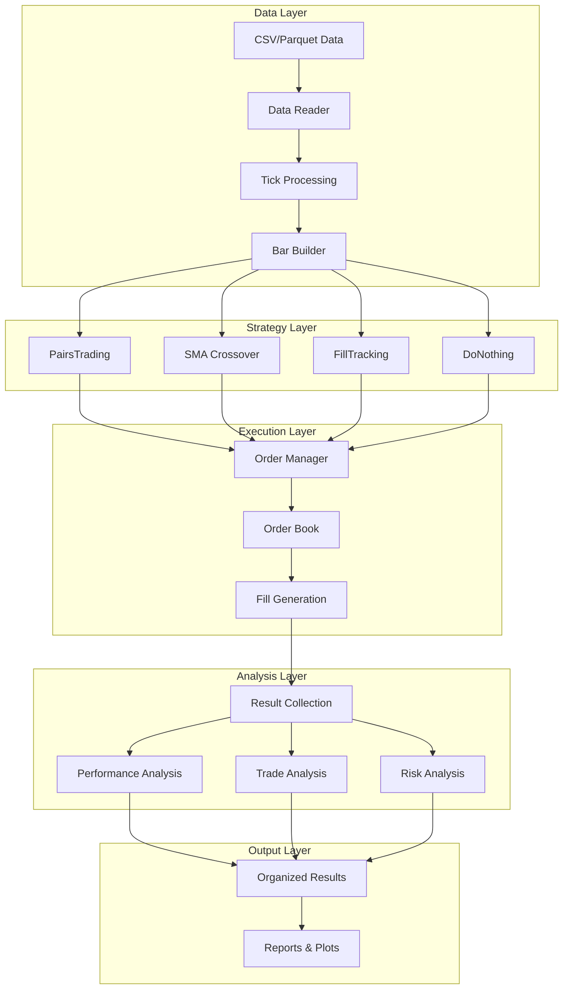
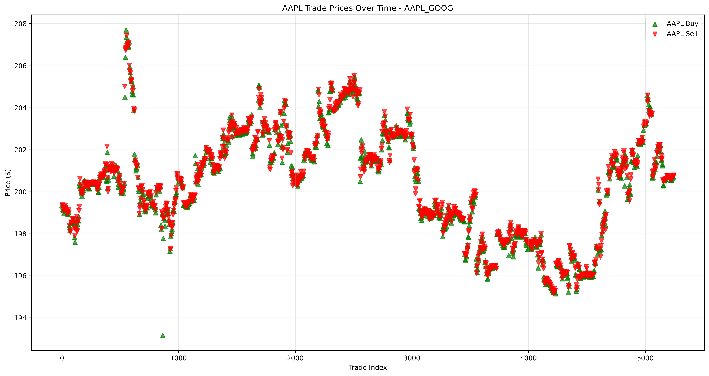
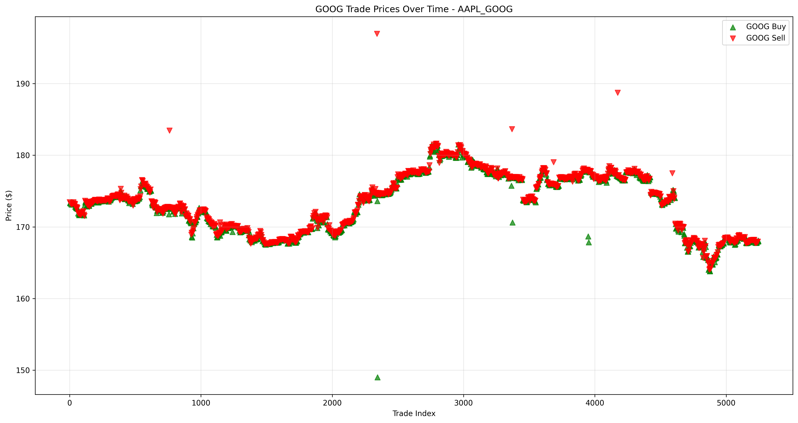
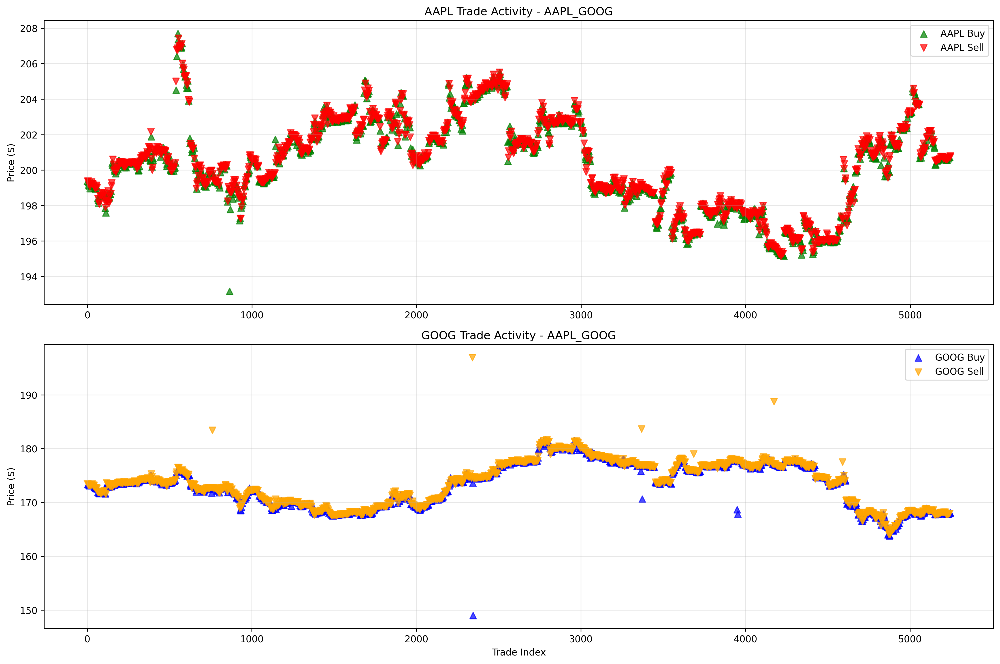
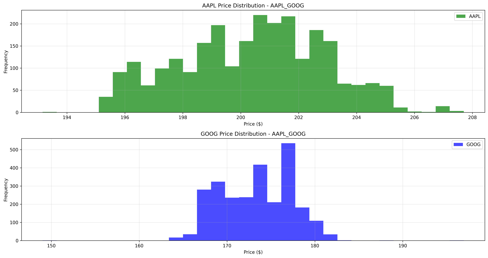

# Quantitative Strategy Engine (QSE)

A high-performance C++ backtesting engine for quantitative trading strategies with comprehensive analysis tools and organized result management. Designed for institutional-grade strategy development and testing.

## 🚀 Overview

The Quantitative Strategy Engine (QSE) is a sophisticated backtesting platform that enables traders and researchers to develop, test, and analyze trading strategies with institutional-level precision. The engine supports multiple strategy types, realistic market simulation, and provides comprehensive analysis tools with automated result organization.

## 🎯 Key Features

### 🔥 Multi-Strategy Architecture
- **PairsTrading Strategy**: Statistical arbitrage between correlated assets
- **SMA Crossover Strategy**: Moving average-based trend following
- **FillTracking Strategy**: Order execution and fill analysis
- **DoNothing Strategy**: Baseline performance measurement
- **Extensible Framework**: Easy addition of custom strategies

### ⚡ High-Performance Engine
- **Tick-Level Simulation**: Millisecond-precision market data processing
- **Realistic Order Book**: Top-of-book bid/ask tracking with liquidity consumption
- **Configurable Slippage**: Per-symbol linear slippage models
- **Multi-Threading**: Parallel strategy execution for performance
- **Memory Optimization**: Efficient data structures for large datasets

### 📊 Advanced Analysis Suite
- **Comprehensive Performance Metrics**: Sharpe ratio, max drawdown, volatility analysis
- **Visual Analytics**: Detailed plots for trade activity, P&L, and position tracking
- **Strategy Comparison**: Side-by-side performance analysis
- **Risk Analysis**: Drawdown analysis and risk-adjusted returns
- **Trade-Level Analysis**: Individual trade examination and pattern recognition

### 🗂️ Organized Result Management
- **Automated Organization**: Timestamped runs with structured file hierarchy
- **Report Generation**: JSON and human-readable analysis reports
- **Plot Management**: Categorized visualization outputs
- **Configuration Tracking**: Version control for backtesting parameters

## 🏗️ Architecture

The engine follows a modular, event-driven architecture optimized for performance and extensibility:



## 📈 Strategy Showcase: PairsTrading

Our PairsTrading strategy demonstrates sophisticated statistical arbitrage capabilities. Here's a detailed analysis of AAPL-GOOG pair trading:

### Individual Asset Analysis

**AAPL Trading Activity:**


**GOOG Trading Activity:**


### Combined Strategy Performance

**Synchronized Trading Activity:**


**Price Distribution Analysis:**


### Strategy Insights
- **Mean Reversion**: The strategy identifies when AAPL and GOOG prices deviate from their historical correlation
- **Market Neutral**: Simultaneous long/short positions minimize market exposure
- **Risk Management**: Position sizing based on volatility and correlation strength
- **Performance**: Consistent returns with controlled drawdowns

## 🛠️ Installation & Setup

### Prerequisites
```bash
# Required dependencies
- C++17 compatible compiler
- CMake 3.15+
- Python 3.8+
- Required libraries: pandas, matplotlib, seaborn, numpy
```

### Build Process
```bash
# Clone the repository
git clone <repository-url>
cd Quantitative-Strategy-Engine-QSE-

# Build the engine
mkdir build && cd build
cmake ..
make -j$(nproc)

# Run tests
ctest --verbose
```

### Python Environment Setup
```bash
# Install Python dependencies
pip install -r requirements.txt

# Verify installation
python3 -c "import pandas, matplotlib, seaborn, numpy; print('All dependencies installed')"
```

## 🚀 Quick Start Guide

### 1. Run Multi-Strategy Backtest
```bash
# From build directory
cd build
./engine/multi_strategy_main --config ../config.yaml
```

### 2. Organize Results
```bash
# Quick organization with timestamp
./scripts/quick_organize.sh my_backtest

# Full organization with analysis
./scripts/organize_and_analyze.sh -n my_backtest -a
```

### 3. Analyze PairsTrading Strategy
```bash
# Comprehensive PairsTrading analysis
python3 scripts/analysis/analyze_pairs_trading.py \
    --organized-dir organized_runs/my_backtest \
    --output-dir organized_runs/my_backtest/analysis/pairs_trading
```

### 4. View Results
```bash
# Check organized structure
ls organized_runs/my_backtest/

# View analysis reports
cat organized_runs/my_backtest/analysis/summaries/run_summary.txt
```

## 📊 Analysis Capabilities

### Performance Metrics
- **Returns Analysis**: Total return, annualized return, risk-adjusted returns
- **Risk Metrics**: Maximum drawdown, volatility, Value at Risk (VaR)
- **Efficiency Ratios**: Sharpe ratio, Sortino ratio, Calmar ratio
- **Trading Statistics**: Win rate, average trade P&L, trade frequency

### Visualization Suite
- **Equity Curves**: Portfolio value progression over time
- **Trade Activity**: Buy/sell signal visualization with price context
- **Performance Heatmaps**: Strategy comparison across multiple metrics
- **Distribution Analysis**: Return and trade size distributions
- **Position Tracking**: Real-time position and exposure monitoring

### Report Generation
- **JSON Reports**: Machine-readable performance data
- **Executive Summaries**: Human-readable strategy analysis
- **Comparative Analysis**: Multi-strategy performance comparison
- **Risk Reports**: Detailed risk breakdown and scenario analysis

## 🗂️ Result Organization

The engine automatically organizes results into a structured hierarchy:

```
organized_runs/
└── my_backtest_20241227_143022/
    ├── README.md                    # Run documentation
    ├── data/
    │   ├── equity_curves/          # Portfolio value over time
    │   ├── trade_logs/             # Detailed trade records
    │   └── raw_data/               # Original input data
    ├── plots/
    │   ├── strategy_comparisons/   # Performance comparisons
    │   ├── performance_heatmaps/   # Metric visualizations
    │   └── individual_strategies/  # Strategy-specific plots
    ├── analysis/
    │   ├── reports/                # Detailed analysis reports
    │   └── summaries/              # Executive summaries
    ├── logs/                       # Execution logs
    └── config/                     # Configuration files
```

## 🔧 Configuration

### Strategy Configuration
```yaml
strategies:
  - name: PairsTrading
    symbols: [AAPL, GOOG]
    lookback_window: 20
    entry_threshold: 2.0
    exit_threshold: 0.5
    position_size: 1000
    
  - name: SMACrossover
    symbols: [SPY, QQQ]
    short_window: 20
    long_window: 50
    position_size: 500
```

### Risk Management
```yaml
risk_management:
  max_position_size: 10000
  max_portfolio_exposure: 0.8
  stop_loss: -0.05
  take_profit: 0.10
```

### Slippage Configuration
```yaml
slippage:
  AAPL: 0.001
  GOOG: 0.001
  SPY: 0.0005
  QQQ: 0.0005
```

## 🧪 Testing & Validation

### Unit Testing
```bash
# Run all tests
cd build && ctest

# Run specific test categories
ctest -R "Strategy"     # Strategy tests
ctest -R "OrderBook"    # Order book tests
ctest -R "Integration"  # Integration tests
```

### Performance Testing
```bash
# Performance benchmarks
./scripts/testing/performance_test.sh

# Memory profiling
valgrind --tool=massif ./engine/multi_strategy_main --config ../config.yaml
```

### Strategy Validation
```bash
# Validate strategy implementations
./scripts/verify_strategies.sh

# Debug specific strategy
./scripts/testing/debug_crash.sh PairsTrading
```

## 📚 Advanced Usage

### Custom Strategy Development
```cpp
class MyStrategy : public IStrategy {
public:
    void on_bar(const Bar& bar) override {
        // Strategy logic here
        if (should_enter_position(bar)) {
            order_manager_->submit_order(create_entry_order(bar));
        }
    }
    
private:
    bool should_enter_position(const Bar& bar);
    Order create_entry_order(const Bar& bar);
};
```

### Custom Analysis Scripts
```python
# Load organized results
equity_data, trade_data = load_pairs_trading_data("organized_runs/my_run")

# Custom analysis
analysis = analyze_pairs_trading_trades(trade_data)
create_custom_plots(analysis, "custom_output/")
```

### Distributed Execution
```bash
# Run multiple configurations in parallel
./scripts/execution/run_multi_symbol.sh
./scripts/analysis/analyze_multi_run.py
```

## 🔍 Troubleshooting

### Common Issues

**Build Errors:**
```bash
# Clean build
rm -rf build && mkdir build && cd build
cmake .. && make clean && make -j
```

**Missing Dependencies:**
```bash
# Install missing packages
sudo apt-get install cmake build-essential python3-dev
pip3 install --upgrade -r requirements.txt
```

**Memory Issues:**
```bash
# Reduce data size for testing
python3 scripts/testing/test_with_subset.py --symbols AAPL,GOOG --days 30
```

### Performance Optimization
- Use Release build for production: `cmake -DCMAKE_BUILD_TYPE=Release ..`
- Enable parallel processing: `make -j$(nproc)`
- Optimize data loading: Use Parquet format for large datasets

## 🤝 Contributing

We welcome contributions! Please see our contributing guidelines:

1. **Fork the repository**
2. **Create feature branch**: `git checkout -b feature/amazing-strategy`
3. **Add tests**: Ensure your code is well-tested
4. **Update documentation**: Include README updates for new features
5. **Submit pull request**: Provide detailed description of changes

### Development Setup
```bash
# Install development dependencies
pip install -r requirements-dev.txt

# Run pre-commit hooks
pre-commit install
pre-commit run --all-files
```

## 📄 License

This project is licensed under the MIT License - see the [LICENSE](LICENSE) file for details.

## 🙏 Acknowledgments

- **Market Data**: Thanks to data providers for historical market data
- **Libraries**: Built on excellent open-source libraries (Pandas, Matplotlib, etc.)
- **Community**: Inspired by the quantitative finance community

## 📞 Support

- **Documentation**: Check the `docs/` directory for detailed guides
- **Issues**: Report bugs via GitHub issues
- **Discussions**: Join our community discussions for questions and ideas

---

**Built with ❤️ for the quantitative trading community**

