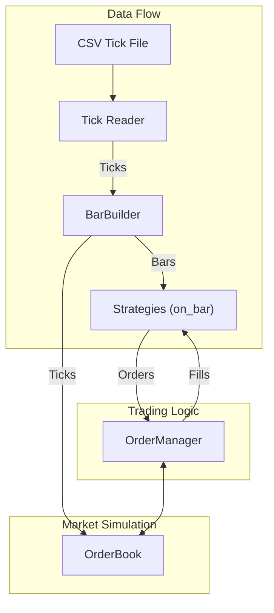

# Quantitative Strategy Engine (QSE)

This repository contains a C++ backtesting engine for quantitative trading strategies, designed for high performance and extensibility. It supports tick-level simulation, realistic order book dynamics, and bar-based strategy execution.

## Features

### Tick-Level Simulation
- Millisecond-timestamped Tick ingestion from CSV or live feeds.
- Out-of-order tick buffering and sorting to handle realistic data imperfections.

### Bar Aggregation
- Configurable time buckets for aggregating ticks into bars using `BarBuilder`.
- Generates Open-High-Low-Close-Volume (OHLCV) bars with precise handling of late-arriving ticks.

### Realistic Order Book
- Top-of-book bid/ask tracking with the `OrderBook` component.
- Support for partial fills, liquidity consumption, and multiple order types (Market, Limit, IOC).

### Configurable Slippage & Impact
- Per-symbol linear slippage model loaded from YAML configuration.
- The model is extensible, allowing for more advanced models like Almgren-Chriss.

### Tick-Level Order Book & Slippage


With our new `OrderBook`, strategies now fill against top‐of‐book liquidity and consume bid/ask sizes:


We've also added configurable linear slippage, which you can toggle in `config/slippage.yaml`:
```yaml
SPY: 0.0005
AAPL: 0.001
```
The impact of slippage on performance is visible in the P&L curve:


## Architecture Overview

The engine follows a modular, event-driven architecture. Data flows from the tick source through the bar builder and into the strategies, which in turn generate orders processed by the order manager.



## Usage

### Build & Test

To build the engine and run the test suite, execute the following commands from the root directory:

```bash
mkdir build && cd build
cmake ..
make -j
ctest
```

### Run a Backtest

A backtest can be run using the main engine executable, pointing it to a configuration file. Python scripts are provided for analysis.

```bash
# From the build directory
./engine/main --config ../config.yaml

# From the root directory
python3 scripts/analyze.py
```

### Inspect Plots

The analysis script generates several plots to visualize the backtest results.

- **Equity Curve**: `plots/equity_curve.png`
- **Signal-to-Noise**: `plots/equity_curves_summary.png`
- **Raw Ticks to Bars**: `docs/plots/ticks_to_bars.png` (Example)
- **Order Book Snapshot**: `docs/plots/order_book_snapshot.png` (Example)

