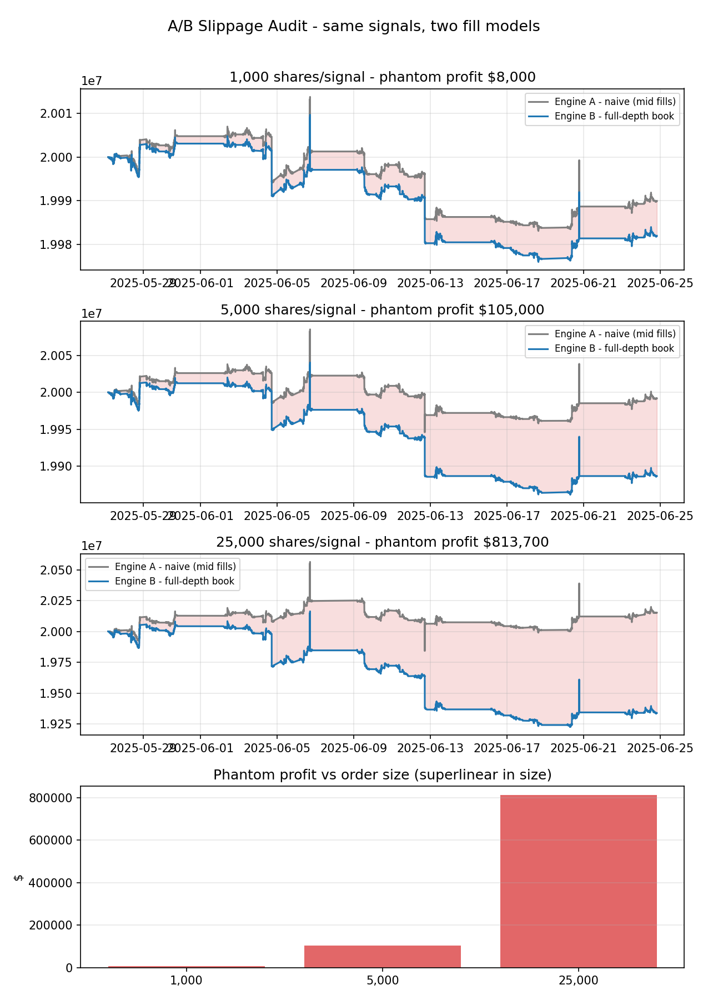
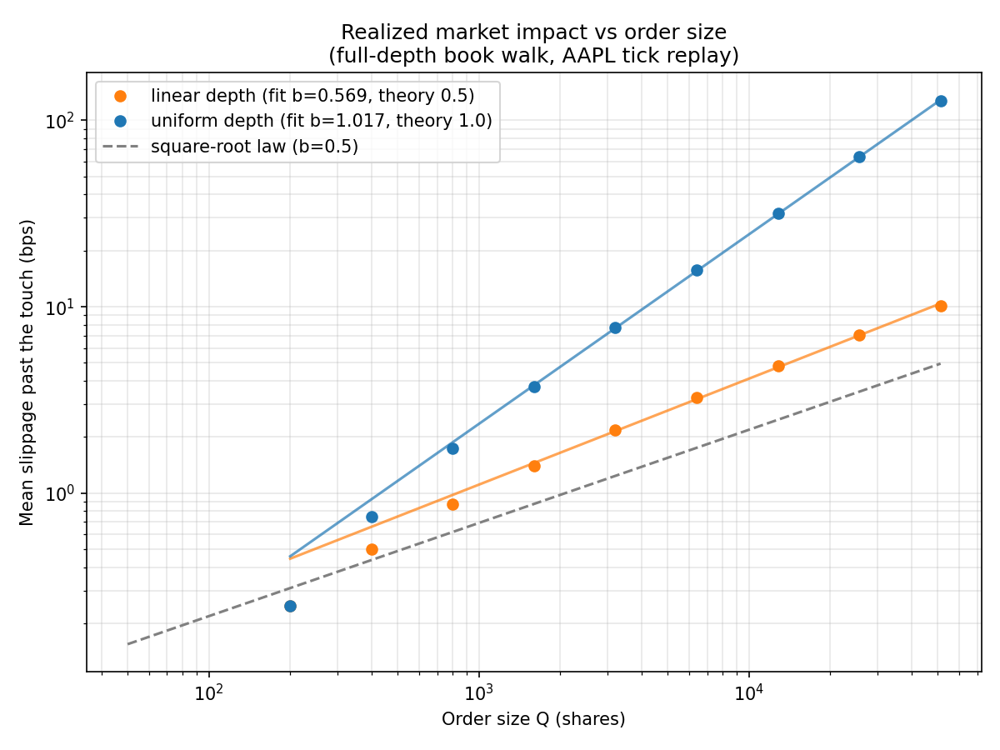
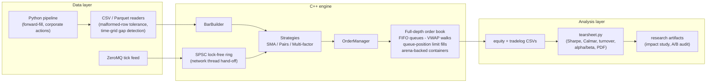

# QSE — Quantitative Strategy Engine

[](https://github.com/MarcusJMyrick/Quantitative-Strategy-Engine-QSE-/actions)

A C++ event-driven backtesting and execution-research engine built around one
question: **how much of a backtest's profit is real, and how much is an
artifact of ignoring market microstructure?**

Most backtesters fill orders instantly at the quoted price. QSE simulates a
full-depth limit order book — FIFO queues at every price level, VWAP-priced
market orders that walk the book, limit orders that wait in queue behind
displayed liquidity — and then **measures the difference**. The engine is
paired with the low-latency machinery real trading systems use (arena
allocation, lock-free queues) and the software discipline they demand
(227 C++ / 33 Python tests, three CI gates, cross-platform determinism).

---

## The 60-second version

| Finding | Number | Where |
|---|---|---|
| **Phantom profit** a naive backtester hallucinates at 25k shares/signal | **$813,700** (naive says +$153k & Sharpe **+1.93**; realistic engine says −$661k & Sharpe **−5.26**) | [A/B slippage audit](docs/research/microstructure/ab_audit_summary.md) |
| Execution cost grows **superlinearly** with order size | 1.8¢ → 4.6¢ → 7.2¢ per share at 1k/5k/25k | same |
| Simulated market impact matches theory | fitted exponent **b = 0.569** vs square-root law 0.5 (R² = 0.999); linear-impact profile b = 1.017 vs 1.0 | [impact study](docs/research/microstructure/results_summary.md) |
| Arena allocator vs `new`/`delete` | **3.5 ns vs 57–70 ns per allocation (16–20×)**; 2.4× on the order-book workload | [benchmark 04](docs/benchmarks/04_arena_allocator.md) |
| Lock-free SPSC ring vs locked queue (producer push, working consumer) | p99 **42 ns vs 16,334 ns (389×)**; worst case 71 µs vs **1.15 ms**; ThreadSanitizer-clean | [benchmark 05](docs/benchmarks/05_spsc_ring_buffer.md) |
| Tick replay throughput | 19,184 ticks in **24 ms** (~800k ticks/s) | `strategy_engine` |
| Cross-platform determinism | Docker (GCC/x86-64) reproduces native (clang/arm64) metrics **exactly** — Sharpe −2.404, 456 trades | [Dockerfile](Dockerfile) |

---

## The flagship result: the A/B slippage audit

The same 455 SMA-crossover signals, the same data, the same cash — run through
two fill models that differ in nothing else:

- **Engine A (naive):** orders fill instantly at the mid. No spread, no
  impact, no queue. The standard tutorial-backtester assumption.
- **Engine B (institutional):** orders go through the full-depth book — they
  pay the touch, walk the seeded depth profile, and receive the true VWAP of
  the liquidity they consume.



| Shares/signal | Naive PnL | Real PnL | Phantom $ | Naive Sharpe | Real Sharpe |
|---|---|---|---|---|---|
| 1,000 | −$10,011 | −$18,033 | $8,000 | −2.12 | −3.71 |
| 5,000 | −$7,887 | −$112,856 | $105,000 | −0.50 | −4.59 |
| 25,000 | **+$152,866** | **−$660,831** | **$813,700** | **+1.93** | **−5.26** |

At scale, the naive backtester reports a fundable Sharpe-1.9 strategy; the
realistic engine shows a heavy loser. Per-share cost grows with size, so the
distortion is worst at exactly the size a profitable-looking strategy would
scale into. Fully deterministic — rerunning the C++ driver and the Python
audit reproduces these numbers bit-for-bit.

The impact model behind Engine B isn't hand-tuned: sweeping order sizes
through the book recovers the theoretical impact exponent of each depth
profile, including the **square-root law** (b ≈ 0.5, R² > 0.998) that
empirical market studies consistently report:

<p align="center"></p>

---

## Architecture


```mermaid
flowchart LR
    subgraph ingest [Data layer]
        CSV["CSV / Parquet readers<br/>(malformed-row tolerance,<br/>time-grid gap detection)"]
        PY["Python pipeline<br/>(forward-fill, corporate actions)"]
        ZMQ["ZeroMQ tick feed"]
    end
    subgraph core [C++ engine]
        RING["SPSC lock-free ring<br/>(network thread hand-off)"]
        BB["BarBuilder"]
        STRAT["Strategies<br/>SMA / Pairs / Multi-factor"]
        OM["OrderManager"]
        BOOK["Full-depth order book<br/>FIFO queues - VWAP walks<br/>queue-position limit fills<br/>arena-backed containers"]
    end
    subgraph out [Analysis layer]
        LOGS["equity + tradelog CSVs"]
        TEAR["tearsheet.py<br/>(Sharpe, Calmar, turnover,<br/>alpha/beta, PDF)"]
        RES["research artifacts<br/>(impact study, A/B audit)"]
    end
    PY --> CSV --> BB --> STRAT
    ZMQ --> RING --> STRAT
    STRAT --> OM --> BOOK --> LOGS --> TEAR --> RES
```

**The microstructure core** (the thesis differentiator):
- `OrderBookFullDepth` — price levels with FIFO order queues, O(1) queue-position
  lookups, market orders that walk levels and return `(filled, VWAP)`,
  per-order fill attribution so strategy orders consumed as makers get credited
- **Queue-position-aware limit fills** — limit orders join the back of the
  queue at their level; trade prints consume the FIFO ahead of them before
  they fill; displayed L1 liquidity is conservatively modeled as always ahead
- Both fill models live behind one config flag, which is what makes the A/B
  audit a controlled experiment

**The quant stack** (beyond the microstructure work): a full cross-sectional
factor pipeline — `UniverseFilter → MultiFactorCalculator →
CrossSectionalRegression → ICMonitor → AlphaBlender → RiskModel →
PortfolioBuilder (constrained QP: net/gross exposure, beta neutrality) →
FactorExecutionEngine` — plus pairs trading and SMA-crossover strategies, all
YAML-configured and unit-tested.

**The low-latency layer:**
- [`qse::Arena`](include/qse/core/Arena.h) — fixed-capacity bump allocator
  exposed as a `std::pmr::memory_resource`; one contiguous block up front, a
  pointer bump per allocation, O(1) wholesale reset, instrumented
  (high-water mark, allocation counts). The order book's containers are
  pmr-backed, so a book built on an arena packs its nodes contiguously for
  cache locality. Measured: **16–20× faster allocation**, 2.4× on the real
  book-building workload.
- [`qse::SPSCRingBuffer`](include/qse/core/SPSCRingBuffer.h) — lock-free
  single-producer/single-consumer ring with `alignas(64)` on both indices
  *and* each side's cached view of the opposite index (false-sharing defense),
  acquire/release hand-off, and a batched `consume_all` drain.
  [`LiveTickPipeline`](include/qse/messaging/LiveTickPipeline.h) wires it
  between the ZeroMQ network thread and the strategy thread with visible
  drop-counting backpressure. The benchmark reports the honest result:
  throughput parity with a mutexed queue in chase mode (both are bound by the
  same cache-line round-trip) — the win is **tail latency**, where the locked
  design's p99 is 389× worse and its worst case tops a millisecond
  (lock-holder preemption). Market-data hand-off is a tail-latency problem.

---

## Engineering quality

- **227 C++ tests** (GoogleTest, includes two 10M-item lock-free stress tests
  with strict ordering + checksum) and **33 Python tests** (pytest, metrics
  asserted to 4 decimals against hand-computed values)
- **Three CI gates on every push:** build + full test suite, `clang-format`/
  `black`/`flake8`, and a `clang-tidy` static-analysis gate
  (warnings-as-errors) — all tool versions pip-pinned so local == CI
- **Two compilers, two standards, two Arrow versions:** every push builds on
  Apple clang (C++17, Arrow 20) and GCC 13 (C++20, Arrow 24), which has
  caught real portability bugs including API deprecations invisible locally
- **ThreadSanitizer** certifies the lock-free ring race-free over 10M items
  on both consumer paths
- **Determinism as a feature:** the Docker image reproduces native results
  exactly, and every research artifact is reproducible run-to-run
- **The gates caught real bugs**, including undefined behavior (a missing
  return on `WeightsLoader`'s success path), 17 silently ignored Arrow
  `Status` returns, an equity-recording path that had never been wired (every
  historical equity CSV was header-only), and three `failbit` hacks that
  silenced stdout in every binary

---

## Run it

### Docker (zero setup, any OS)

```bash
git clone --recurse-submodules <repository-url>
cd Quantitative-Strategy-Engine-QSE-
docker build -t qse .
docker run -v "$PWD/out:/results" qse
```

That single run executes the SMA 20/50 backtest over the bundled AAPL
minute-tick data and writes `equity_curve.csv`, `tradelog.csv`, and a 3-page
performance `tearsheet.pdf` into `./out/`.

### Native build (macOS / Linux)

```bash
# deps: cmake, a C++17 compiler, arrow+parquet, protobuf, zeromq, yaml-cpp
git clone --recurse-submodules <repository-url>
cmake -S . -B build -DCMAKE_BUILD_TYPE=Release
cmake --build build -j8
cd build && ctest              # 227 tests
./strategy_engine              # sample backtest (from repo root)
```

### Reproduce the research

```bash
python3 -m venv venv && ./venv/bin/pip install -r requirements.txt
./venv/bin/python scripts/analysis/impact_study.py     # impact exponents
./venv/bin/python scripts/analysis/slippage_audit.py   # phantom-profit audit
./venv/bin/python scripts/analysis/tearsheet.py --equity equity_curve.csv \
    --tradelog tradelog.csv --benchmark data/raw_AAPL.csv --out tearsheet.pdf
./build/arena_bench && ./build/spsc_bench               # latency benchmarks
./build/spsc_tsan_stress                                # TSan certification
```

---

## Repository map

```
include/qse/, src/       C++17/20 engine: core, data, order, strategy, factor,
                         messaging, exe + tools (impact_sweep, ab_audit, benches)
tests/cpp/               227 GoogleTest cases incl. mocks and stress tests
scripts/analysis/        tearsheet, impact study, slippage audit
scripts/data/            download/process pipeline, forward-fill, corporate actions
tests/python/            33 pytest cases with hand-computed expected values
docs/research/           committed research artifacts (plots, summaries, PDFs)
docs/benchmarks/         benchmark write-ups with reproduction commands
docs/PROJECT_PHASES.md   full narrative: every phase, design rationale, results
docs/TASK_BREAKDOWN.md   execution checklist with per-task done-when criteria
config/                  YAML strategy configs + real corporate-actions history
```

## Documentation

- **[PROJECT_PHASES.md](docs/PROJECT_PHASES.md)** — the whitepaper: all eleven
  phases in detail, including the design rationale for every component above
- **[TASK_BREAKDOWN.md](docs/TASK_BREAKDOWN.md)** — the engineering log:
  testable chunks, each with an explicit done-when criterion and its outcome
- **[Benchmarks](docs/benchmarks/)** · **[Research artifacts](docs/research/microstructure/)**

## Status

Complete: microstructure engine, factor stack, data-quality pipeline,
research artifacts, low-latency layer, CI/format/lint gates, Docker.
In progress: live paper-trading integration (Alpaca) on top of the
lock-free tick pipeline, and the thesis write-up. The full plan and its
state live in [TASK_BREAKDOWN.md](docs/TASK_BREAKDOWN.md).
