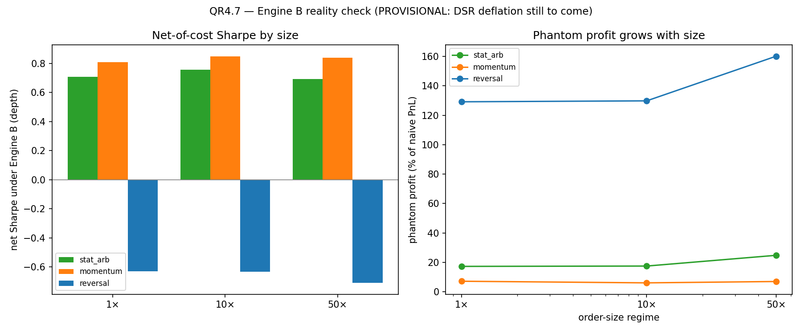
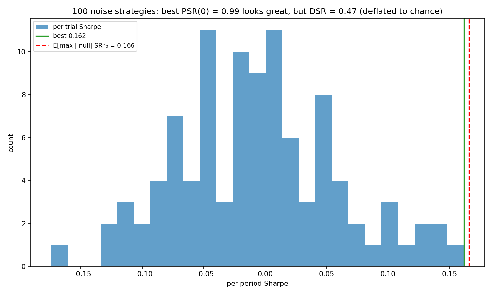
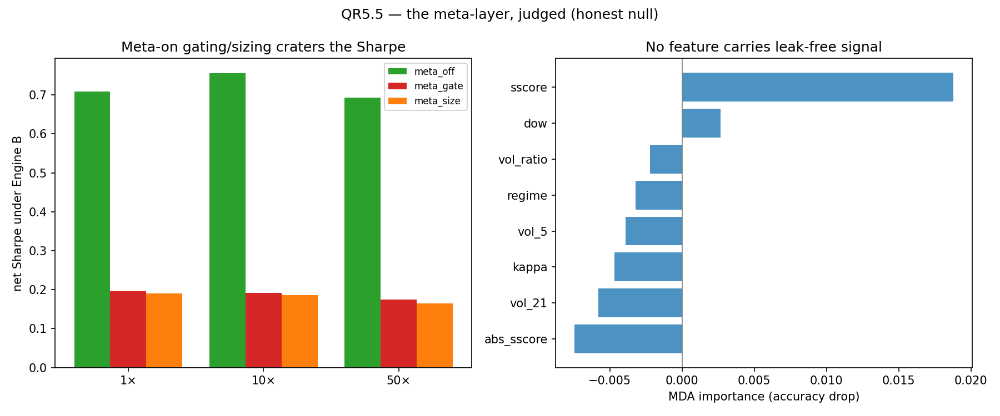
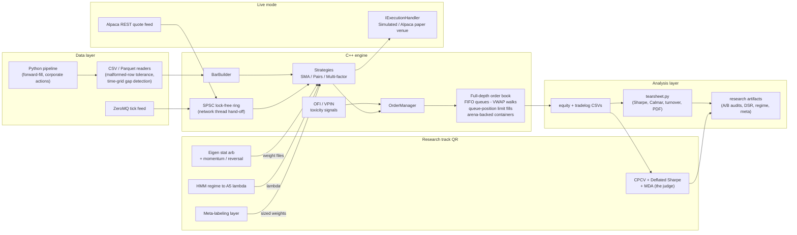

# QSE — Quantitative Strategy Engine

[](https://github.com/MarcusJMyrick/Quantitative-Strategy-Engine-QSE-/actions)

A C++ event-driven backtesting and execution-research engine built around one
question: **how much of a backtest's profit is real, and how much is an
artifact of ignoring market microstructure?**

Most backtesters fill orders instantly at the quoted price. QSE simulates a
full-depth limit order book — FIFO queues at every price level, VWAP-priced
market orders that walk the book, limit orders that wait in queue behind
displayed liquidity — and then **measures the difference**. The engine is
paired with the low-latency machinery real trading systems use (arena
allocation, lock-free queues), a **live paper-trading mode** that runs the
same strategy code against a real venue, and the software discipline both
demand (302 C++ / 258 Python tests, three CI gates, cross-platform
determinism).

On top of the execution engine sits a **complete quantitative-research track**
built under one rule — a strategy is *viable* only if it survives the realistic
fill engine **and** clears a Sharpe deflated for the number of configurations
tried. Under that bar the track's flagship strategies produce **honest
negatives** — cheap momentum beats elaborate stat arb, a toxicity filter *raises*
slippage, meta-labeling adds nothing, and hierarchical risk parity is beaten by
1/N. The deliverable is the machinery that lets those negatives be *stated with
confidence* instead of buried under an overfit backtest.

---

## The 60-second version

| Finding | Number | Where |
|---|---|---|
| **Phantom profit** a naive backtester hallucinates at 25k shares/signal | **$813,700** (naive says +$153k & Sharpe **+1.93**; realistic engine says −$661k & Sharpe **−5.26**) | [A/B slippage audit](docs/research/microstructure/ab_audit_summary.md) |
| Execution cost grows **superlinearly** with order size | 1.8¢ → 4.6¢ → 7.2¢ per share at 1k/5k/25k | same |
| Simulated market impact matches theory | fitted exponent **b = 0.569** vs square-root law 0.5 (R² = 0.999); linear-impact profile b = 1.017 vs 1.0 | [impact study](docs/research/microstructure/results_summary.md) |
| Arena allocator vs `new`/`delete` | **3.5 ns vs 57–70 ns per allocation (16–20×)**; 2.4× on the order-book workload | [benchmark 04](docs/benchmarks/04_arena_allocator.md) |
| Lock-free SPSC ring vs locked queue (tail latency) | p99 **42 ns vs 16,334 ns (389×)**; worst case 71 µs vs **1.15 ms**; ThreadSanitizer-clean | [benchmark 05](docs/benchmarks/05_spsc_ring_buffer.md) |
| Cross-platform determinism | Docker (GCC/x86-64) reproduces native (clang/arm64) metrics **exactly** — Sharpe −2.404, 456 trades | [Dockerfile](Dockerfile) |
| **Live paper trading verified end-to-end** | 15-min session: 5 crossover signals → 5 real fills → **5/5 orders reconciled** local == venue | `live_engine` (Alpaca REST → lock-free ring → strategy → venue) |
| Market factor structure via random-matrix theory | market eigenvalue clears the Marchenko-Pastur noise edge (λ+ = 2.25) in **100% of 1,432 rolling windows**; MP retains 1–2 factors while "explain 55%" wobbles 1–4 | [stat-arb research](docs/research/statarb/README.md) |
| **Stat arb vs baselines under Engine B** | **credible negative:** cheap 12-1 momentum (net Sharpe **0.84**) beats the eigen stat arb (**0.69**) once realistic fills are charged | [stat-arb research](docs/research/statarb/README.md) |
| Deflated Sharpe catches multiple-testing | 100 noise strategies: luckiest shows **PSR(0) = 0.99** but **DSR = 0.47**; QR4's best swept config **DSR = 0.61** vs 12 trials | [validation research](docs/research/validation/README.md) |
| Regime overlay is risk control, not alpha | causal Gaussian HMM labels **calm 44% / elevated 33% / turbulent 23%** of days; turbulent clusters in the 2022 bear + Apr-2025 selloff → drives A5 λ 0→50 (min-variance posture) | [regime research](docs/research/regime/README.md) |
| **Toxicity filter *raises* slippage** | **robust negative:** VPIN+OFI passive-rest gate = **0.01168 vs blind 0.01000** — 7 fallbacks avg **+$0.54** (adverse-selection tail) swamp 27 spread captures | [execution research](docs/research/execution/README.md) |
| **Meta-labeling adds nothing** | under Engine B gating craters Sharpe **0.69 → 0.17**; DSR meta-off **0.94** > meta-on **0.77**; MDA: no engineered feature beats 0.500-vs-0.502 CV | [meta research](docs/research/meta/README.md) |
| **HRP vs MVO out-of-sample** | MVO collapses (Sharpe **−0.35**, 3.8× churn — Σ⁻¹ instability); HRP repairs it (**0.65**) but **1/N still wins (0.90)** | [portfolio research](docs/research/portfolio/README.md) |

---

## The flagship result: the A/B slippage audit

The same 455 SMA-crossover signals, the same data, the same cash — run through
two fill models that differ in nothing else:

- **Engine A (naive):** orders fill instantly at the mid. No spread, no
  impact, no queue. The standard tutorial-backtester assumption.
- **Engine B (institutional):** orders go through the full-depth book — they
  pay the touch, walk the seeded depth profile, and receive the true VWAP of
  the liquidity they consume.


| Shares/signal | Naive PnL | Real PnL | Phantom $ | Naive Sharpe | Real Sharpe |
|---|---|---|---|---|---|
| 1,000 | −$10,011 | −$18,033 | $8,000 | −2.12 | −3.71 |
| 5,000 | −$7,887 | −$112,856 | $105,000 | −0.50 | −4.59 |
| 25,000 | **+$152,866** | **−$660,831** | **$813,700** | **+1.93** | **−5.26** |

At scale, the naive backtester reports a fundable Sharpe-1.9 strategy; the
realistic engine shows a heavy loser. Per-share cost grows with size, so the
distortion is worst at exactly the size a profitable-looking strategy would
scale into. Fully deterministic — rerunning the C++ driver and the Python
audit reproduces these numbers bit-for-bit.

The impact model behind Engine B isn't hand-tuned: sweeping order sizes
through the book recovers the theoretical impact exponent of each depth
profile, including the **square-root law** (b ≈ 0.5, R² > 0.998) that
empirical market studies consistently report:

<p align="center"></p>

---

## The research track: strategy discovery under statistical guardrails

The A/B audit above is exactly why "profitable in a paper account" means
nothing: paper fills are near-mid, instant, and infinitely deep. So the
research track (**Track QR, complete**) holds every strategy to a harder bar —
**survive Engine B's realistic fills *and* clear a Sharpe deflated for the
number of configurations tried** (CPCV + Deflated Sharpe Ratio, the
López de Prado machinery). The honest headline it targets is not "a money
printer" but *"after realistic fills and a search-deflated Sharpe, this survives
/ does not survive"* — **and a defensible negative is a result.** Under that bar,
it delivers five of them.

### QR-P1 — Eigenportfolio statistical arbitrage, and its honest verdict

**Avellaneda-Lee stat arb**: rolling 60-day PCA on a 15-name large-cap tech
universe with the retained-factor count set by **random-matrix theory** — not by
hand — dropping eigenvalues below the Marchenko-Pastur noise edge
`λ+ = (1+√(N/T))² = 2.25`. The market mode clears the edge in every window; the
popular "explain 55% of variance" rule retains 1–4 factors over the same sample,
which is precisely the arbitrariness the cutoff removes.


Idiosyncratic residuals (orthogonal to their factors to 7×10⁻¹⁵) become
mean-reverting OU processes with a median **5.8-day half-life**; a hysteresis
state machine turns the s-scores into a dollar-neutral daily book in the exact
`weights_YYYYMMDD.csv` format the C++ engine loads (**1,431 files, net to 10⁻¹⁶**,
lagged one day — no look-ahead). Run through the real full-depth book against
cheap baselines:



**The QR-P1 payoff is a credible negative:** under realistic fills, cheap **12-1
momentum (net Sharpe 0.84) beats the elaborate stat arb (0.69)** — the stat arb
turns over 16% of its book daily (17–25% phantom cost) against momentum's 4%.
After honest fills, the sophisticated machinery does not earn its complexity over
a one-line rule — far more defensible than a Sharpe-2 backtest.

### QR-P2 — The truth serum (CPCV + Deflated Sharpe)

The credibility layer that judges everything else: purging + embargo,
**Combinatorial Purged CV**, a trial registry, and the **Deflated Sharpe Ratio**
(Bailey & López de Prado). Its calibration test is stark — 100 pure-noise
strategies, the luckiest with **PSR(0) = 0.99** (near-certain skill) but
**DSR = 0.47** once deflated for the search. Wired through QR4, the band/window
sweep's best config has a cost-free Sharpe of 0.92 but a **DSR of 0.61** against
12 trials — clearing chance only modestly, and *before* the Engine B haircut.



### QR-P3 — Regime overlay (risk control, not alpha)

A causal, diagonal-covariance **Gaussian HMM** (hand-rolled numpy, filtered
forward pass, expanding-window refit — never peeks ahead) clusters trailing SPY
volatility features into **calm / elevated / turbulent** states, anti-whipsaw
debounced, then maps the committed regime to the A5 mean-variance **λ**
(`[0, 5, 50]`). Turbulent days (23% of the sample) cluster in the 2022 bear and
the April-2025 selloff — exactly where λ=50 pushes the optimizer toward a
minimum-variance, lower-gross posture. The design goal is honest: **cut
drawdown**, lifting Sharpe by shrinking the denominator, not by forecasting
returns.

### QR-P4 — Execution intelligence, and a robust negative

**OFI** (Cont-Kukanov order-flow imbalance) and **VPIN** (Easley-López de
Prado-O'Hara) toxicity signals feed a passive-rest policy in `OrderManager`: delay
crossing the spread only when flow is toxic *and* directionally favorable.
**The A/B audit rejects it** — on 1,893 orders the filter *increases* average
slippage (**0.01168 vs blind 0.01000**). Of 34 rested orders, 27 capture the
spread (−$0.01 each), but the 7 that don't fall back after the toxic flow has run
away — avg **+$0.54**, an adverse-selection tail that swamps the captures. The
lesson (robust across every configuration swept): on 1-minute AAPL, high VPIN
predicts *continued* adverse movement, so resting into it is the wrong move.

### QR-P5 — The learned meta-layer, judged and rejected

The one defensible ML addition: López de Prado **meta-labeling** — a classifier
sizes/gates the primary bet without ever predicting return direction, trained on
triple-barrier labels with sample-uniqueness weights and validated **only**
through purged CPCV. Then the same truth serum is turned on it:



- **Under Engine B:** gating on the meta-model **craters** net Sharpe
  (0.69 → 0.17) — it drops ~82% of trades without selecting better ones.
- **DSR for both:** meta-off **0.94** vs the best meta-on config **0.77** — no
  configuration beats doing nothing.
- **MDA under purged CV:** the model sits on the coin-flip (0.500 vs 0.502) and
  no *engineered* feature carries leak-free signal.

**An honest null**: meta-labeling adds nothing here, and naive application
subtracts. The guardrails make that a *finding* rather than a guess.

### QR-X — Hierarchical Risk Parity vs mean-variance

The optional allocation extension. Walk-forward on the QR4 universe, judged under
CPCV: **MVO collapses** out-of-sample (Sharpe −0.35, 3.8× the turnover — the
`Σ⁻¹` instability on a near-singular 15-name covariance), **HRP repairs it** (0.65
at 3.8× less churn — clustering buys robustness while forecasting nothing), **but
even HRP does not beat 1/N** (0.90, zero turnover). Hierarchical clustering earns
its keep as risk control, not alpha.

> **The track's thesis, proven five times over:** building the guardrails first
> is what lets the project report *"does not survive"* with conviction. A
> defensible negative, backed by realistic fills and a search-deflated Sharpe, is
> the entire point. Full narrative: [PROJECT_PHASES.md](docs/PROJECT_PHASES.md)
> Phases 12–16; execution log: [TASK_BREAKDOWN.md](docs/TASK_BREAKDOWN.md).

---

## Architecture


```mermaid
flowchart LR
    subgraph ingest [Data layer]
        CSV["CSV / Parquet readers<br/>(malformed-row tolerance,<br/>time-grid gap detection)"]
        PY["Python pipeline<br/>(forward-fill, corporate actions)"]
        ZMQ["ZeroMQ tick feed"]
    end
    subgraph core [C++ engine]
        RING["SPSC lock-free ring<br/>(network thread hand-off)"]
        BB["BarBuilder"]
        STRAT["Strategies<br/>SMA / Pairs / Multi-factor"]
        TOX["OFI / VPIN<br/>toxicity signals"]
        OM["OrderManager"]
        BOOK["Full-depth order book<br/>FIFO queues - VWAP walks<br/>queue-position limit fills<br/>arena-backed containers"]
    end
    subgraph research [Research track QR]
        SA["Eigen stat arb<br/>+ momentum / reversal"]
        REG["HMM regime to A5 lambda"]
        META["Meta-labeling layer"]
        VAL["CPCV + Deflated Sharpe<br/>+ MDA (the judge)"]
    end
    subgraph live [Live mode]
        FEED["Alpaca REST quote feed"]
        EXE["IExecutionHandler<br/>Simulated / Alpaca paper venue"]
    end
    subgraph out [Analysis layer]
        LOGS["equity + tradelog CSVs"]
        TEAR["tearsheet.py<br/>(Sharpe, Calmar, turnover, PDF)"]
        RES["research artifacts<br/>(A/B audits, DSR, regime, meta)"]
    end
    PY --> CSV --> BB --> STRAT
    ZMQ --> RING --> STRAT
    FEED --> RING
    TOX --> OM
    STRAT --> OM --> BOOK --> LOGS --> TEAR --> RES
    STRAT --> EXE
    SA -->|weight files| STRAT
    REG -->|lambda| STRAT
    META -->|sized weights| STRAT
    LOGS --> VAL --> RES
```

**The microstructure core** (the thesis differentiator):
- `OrderBookFullDepth` — price levels with FIFO order queues, O(1) queue-position
  lookups, market orders that walk levels and return `(filled, VWAP)`,
  per-order fill attribution so strategy orders consumed as makers get credited
- **Queue-position-aware limit fills** — limit orders join the back of the
  queue; trade prints consume the FIFO ahead of them before they fill
- Both fill models live behind one config flag, which is what makes the A/B
  audit a controlled experiment

**The quant stack:** a full cross-sectional factor pipeline — `UniverseFilter →
MultiFactorCalculator → CrossSectionalRegression → ICMonitor → AlphaBlender →
RiskModel → PortfolioBuilder → FactorExecutionEngine` — plus the Track-QR
research layer (eigen stat arb, HMM regime overlay, OFI/VPIN toxicity signals,
meta-labeling, and the CPCV/DSR/MDA validation harness that judges them all).
`PortfolioBuilder` is a constrained QP (net/gross exposure, beta neutrality) with
a true **mean-variance objective** `−λ/2·wᵀΣw`, where λ = 0 reproduces pure
alpha-maximization bit-for-bit — and QR-P3's regime overlay drives that λ.

**The live layer** (same strategy code, real venue): a venue-agnostic
`IExecutionHandler` with two implementations — the simulated engine and
`AlpacaExecutionHandler` over the paper REST API (HTTP behind an injectable seam,
so CI tests the full order lifecycle with zero network). `live_engine` wires
Alpaca quote polling → the lock-free ring → BarBuilder → strategy → venue,
reconciling per-order fills against the venue at session end. Verified live: 5
signals, 5 fills, 5/5 reconciled.

**The low-latency layer:**
- [`qse::Arena`](include/qse/core/Arena.h) — fixed-capacity bump allocator
  exposed as a `std::pmr::memory_resource`; the order book's pmr-backed
  containers pack nodes contiguously for cache locality. Measured: **16–20×
  faster allocation**, 2.4× on the real book-building workload.
- [`qse::SPSCRingBuffer`](include/qse/core/SPSCRingBuffer.h) — lock-free
  single-producer/single-consumer ring with `alignas(64)` false-sharing defense,
  acquire/release hand-off, batched drain. The benchmark reports the honest
  result: throughput parity with a mutexed queue in chase mode (both bound by the
  same cache-line round-trip) — the win is **tail latency**, where the locked
  design's p99 is 389× worse and its worst case tops a millisecond (lock-holder
  preemption). Market-data hand-off is a tail-latency problem.

---

## Engineering quality

- **302 C++ tests** (GoogleTest, incl. two 10M-item lock-free stress tests with
  strict ordering + checksum) and **258 Python tests** (pytest, metrics asserted
  against hand-computed values) — including the full research layer: a causality
  test proves appending future data leaves every emitted row bit-identical, the
  Marchenko-Pastur cutoff retains 0 factors on pure noise and exactly the planted
  factor otherwise, the OU estimator recovers known (κ, m, σ), the generated
  weight files load back through the real C++ `WeightsLoader`, CPCV is proven to
  leave no train/test overlap, the HMM refit is proven causal, and the meta-layer
  is proven to reproduce the raw book bit-for-bit when off
- **Three CI gates on every push:** build + full test suite, `clang-format`/
  `black`/`flake8`, and a `clang-tidy` static-analysis gate
  (warnings-as-errors) — all tool versions pinned so local == CI
- **Two compilers, two standards, two Arrow versions:** every push builds on
  Apple clang (C++17, Arrow 20) and GCC 13 (C++20, Arrow 24), which has caught
  real portability bugs invisible locally
- **ThreadSanitizer** certifies the lock-free ring race-free over 10M items
- **Determinism as a feature:** the Docker image reproduces native results
  exactly, and every research artifact is reproducible run-to-run
- **The gates caught real bugs**, including undefined behavior (a missing return
  on `WeightsLoader`'s success path), 17 silently ignored Arrow `Status` returns,
  an equity-recording path that had never been wired (every historical equity CSV
  was header-only), a `clang-tidy` unchecked-`std::optional` access on the
  VPIN/OFI toxicity path, a `.gitignore` inline-comment bug that silently kept a
  committed data file ignored, and an HMM refit that ran in 171 s until it was
  restructured to a causal segmented pass (~9 s)

---

## Run it

### Docker (zero setup, any OS)

```bash
git clone --recurse-submodules <repository-url>
cd Quantitative-Strategy-Engine-QSE-
docker build -t qse .
docker run -v "$PWD/out:/results" qse
```

That single run executes the SMA 20/50 backtest over the bundled AAPL
minute-tick data and writes `equity_curve.csv`, `tradelog.csv`, and a 3-page
performance `tearsheet.pdf` into `./out/`.

### Native build (macOS / Linux)

```bash
# deps: cmake, a C++17 compiler, arrow+parquet, protobuf, zeromq, yaml-cpp, libcurl
git clone --recurse-submodules <repository-url>
cmake -S . -B build -DCMAKE_BUILD_TYPE=Release
cmake --build build -j8
cd build && ctest              # 302 tests
./strategy_engine              # sample backtest (from repo root)
```

### Live paper trading (Alpaca)

```bash
set -a; source .env; set +a    # APCA_API_KEY_ID / APCA_API_SECRET_KEY (paper)
./build/live_engine --paper --minutes 10   # quote feed → strategy → venue → reconcile
```

Runs the same strategy code path as the backtest against the Alpaca paper venue,
logging orders/fills locally and reconciling them at session end. Guarded to
paper-only; refuses to start without `--paper` and credentials.

### Reproduce the research

```bash
python3 -m venv venv && ./venv/bin/pip install -r requirements.txt

# Microstructure: impact exponents + phantom-profit A/B audit
./venv/bin/python scripts/analysis/impact_study.py
./venv/bin/python scripts/analysis/slippage_audit.py

# QR-P1 stat arb: universe → PCA → residuals → OU s-score → weights → baselines
./venv/bin/python scripts/research/statarb/build_universe.py
./venv/bin/python scripts/research/statarb/rolling_pca.py
./venv/bin/python scripts/research/statarb/residuals.py
./venv/bin/python scripts/research/statarb/ou_sscore.py
./venv/bin/python scripts/research/statarb/signals.py
./venv/bin/python scripts/research/statarb/baselines.py
./build/statarb_audit --name stat_arb --weights-dir data/universe/weights  # Engine A/B
./venv/bin/python scripts/analysis/statarb_audit.py

# QR-P2 validation: DSR multiple-testing demo + QR4 sweep deflation
./venv/bin/python scripts/research/validation/deflated_sharpe.py
./venv/bin/python scripts/research/statarb/deflate_qr4.py

# QR-P3 regime: causal features → HMM → committed regime → A5 λ
./venv/bin/python scripts/research/regime/regime_features.py
./venv/bin/python scripts/research/regime/regime_hmm.py

# QR-P4 execution: OFI/VPIN toxicity A/B audit
./build/toxicity_audit && ./venv/bin/python scripts/analysis/toxicity_audit.py

# QR-P5 meta-labeling: dataset → sizing → judge (Engine B + DSR + MDA)
./venv/bin/python scripts/research/meta/build_meta_dataset.py
./venv/bin/python scripts/research/meta/meta_sizing.py --mode gate
./venv/bin/python scripts/research/meta/judge_meta.py --run-engine-b

# QR-X portfolio: MVO vs HRP out-of-sample under CPCV
./venv/bin/python scripts/research/portfolio/compare_allocators.py

# Latency benchmarks + TSan certification
./build/arena_bench && ./build/spsc_bench && ./build/spsc_tsan_stress
```

---

## Repository map

```
include/qse/, src/       C++17/20 engine: core, data, order, strategy, factor,
                         messaging, exe, live, microstructure (OFI/VPIN)
                         + tools (impact_sweep, ab_audit, statarb_audit,
                         toxicity_audit, live_engine, benches)
tests/cpp/               302 GoogleTest cases incl. mocks and stress tests
tests/python/            258 pytest cases with hand-computed expected values
scripts/analysis/        tearsheet, impact study, slippage + toxicity audits
scripts/data/            download/process pipeline, forward-fill, corporate actions
scripts/research/statarb/    QR-P1 eigen stat arb: universe, PCA, residuals, OU,
                             weights, reversal/momentum baselines, DSR wiring
scripts/research/validation/ QR-P2 truth serum: purge/embargo, CPCV, registry, DSR
scripts/research/regime/     QR-P3 regime: causal features, Gaussian HMM, debounce
scripts/research/meta/       QR-P5 meta-labeling: triple-barrier, uniqueness,
                             meta-model, sizing, judge (Engine B + DSR + MDA)
scripts/research/portfolio/  QR-X allocators: MVO / HRP / IVP + walk-forward compare
docs/research/           committed research artifacts (microstructure, factor,
                         statarb, validation, regime, execution, meta, portfolio)
docs/benchmarks/         benchmark write-ups with reproduction commands
docs/PROJECT_PHASES.md   full narrative: every phase, design rationale, results
docs/TASK_BREAKDOWN.md   execution checklist with per-task done-when criteria
config/                  YAML strategy configs + real corporate-actions history
```

## Documentation

- **[PROJECT_PHASES.md](docs/PROJECT_PHASES.md)** — the whitepaper: all phases
  in detail (execution engine 1–11, research track 12–16) with the design
  rationale for every component
- **[TASK_BREAKDOWN.md](docs/TASK_BREAKDOWN.md)** — the engineering log: testable
  chunks, each with an explicit done-when criterion and its outcome
- **[Benchmarks](docs/benchmarks/)** · **Research:
  [microstructure](docs/research/microstructure/) ·
  [factor](docs/research/factor/) ·
  [stat arb (QR-P1)](docs/research/statarb/README.md) ·
  [validation / CPCV+DSR (QR-P2)](docs/research/validation/README.md) ·
  [regime (QR-P3)](docs/research/regime/README.md) ·
  [execution / OFI+VPIN (QR-P4)](docs/research/execution/README.md) ·
  [meta-labeling (QR-P5)](docs/research/meta/README.md) ·
  [portfolio / HRP (QR-X)](docs/research/portfolio/README.md)**

## Status

**Complete:** the microstructure engine, factor stack (incl. mean-variance
optimizer), data-quality pipeline, low-latency layer, CI/format/lint gates,
Docker, **live Alpaca paper-trading** (verified end-to-end), and the entire
**quantitative-research track (Track QR: QR-P1 → QR-P5 + the QR-X HRP
extension)** — every strategy judged under Engine B fills and a search-deflated
Sharpe, with the honest negatives reported plainly.

**Next:** the thesis write-up (Track F) that packages these results. The full
plan and its state live in [TASK_BREAKDOWN.md](docs/TASK_BREAKDOWN.md).
