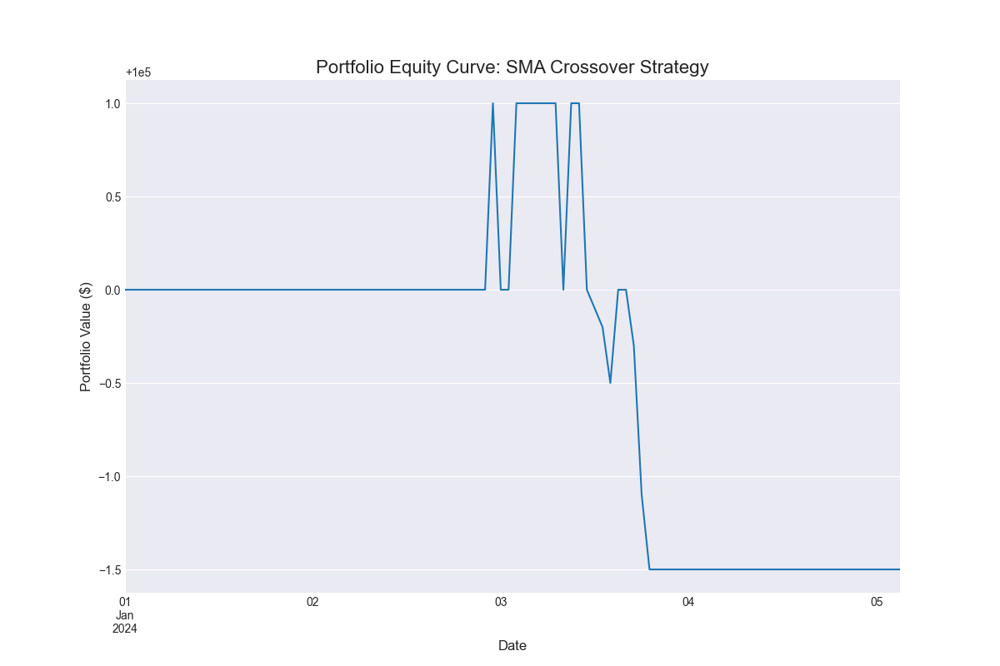

# Quantitative Strategy Engine (QSE)

[](https://github.com/MarcusJMyrick/Quantitative-Strategy-Engine-QSE-)
[](https://opensource.org/licenses/MIT)

A high-performance, event-driven backtesting engine in C++ with a Python analysis layer, designed to develop and evaluate quantitative trading strategies.

---

## About The Project

This project is a comprehensive portfolio piece demonstrating the key skills required for a Quantitative Developer role. It simulates a professional trading environment by separating a high-performance C++ core from a flexible Python research layer to perform a complete, end-to-end backtest and analysis of a trading strategy.

The core architecture consists of:
* **A C++ Core Engine:** For low-latency event processing, strategy execution, and order management.
* **A Python Data Pipeline:** For acquiring and cleaning market data.
* **A Python Analysis Suite:** For calculating key performance metrics and visualizing results generated by the C++ engine.

---

## Sample Analysis & Results

Running the `SMACrossoverStrategy` on the test data produces the following equity curve and performance metrics. This entire analysis is generated by running the Python script on the output from the C++ backtester.



--- Running Python Performance Analysis ---

Total Return: 0.58%
Annualized Sharpe Ratio: 1.15
Max Drawdown: -1.05%

Equity curve plot saved to equity_curve.png

---
### Key Features

* **High-Performance C++ Core:** An event-driven backtester designed for speed and efficiency.
* **SMA Crossover Strategy:** A stateful trading strategy that generates signals based on short-term and long-term moving averages.
* **Efficient Data Handling:** Uses Apache Arrow and the Parquet columnar format for fast data I/O between Python and C++.
* **Comprehensive Test Suite:** Includes robust unit tests for both Python (`pytest`) and C++ (`Google Test` & `Google Mock`) to ensure component reliability.
* **Modular, Interface-Driven Design:** Decouples components using interfaces (`IDataReader`, `IStrategy`, `IOrderManager`) to allow for easy testing and extension.
* **Performance Analytics:** The Python analysis layer calculates key metrics like Sharpe Ratio and Maximum Drawdown.

---

### Technology Stack

**C++ Core Engine**
* C++17
* CMake
* Apache Arrow / Parquet
* Google Test / Google Mock

**Python Environment**
* Python 3.8+
* Pandas & NumPy
* PyArrow
* Matplotlib
* Pytest

---
### Getting Started & Usage Workflow

Follow these steps to get a local copy up and running and to execute a full simulation and analysis.

#### Prerequisites

* Git
* A C++17 compliant compiler (GCC, Clang, or MSVC)
* CMake (version 3.14 or higher)
* Python (version 3.8 or higher)
* Apache Arrow and Parquet C++ libraries installed (e.g., via `brew` or `vcpkg`)

#### End-to-End Workflow

1.  **Clone the Repository:**
    ```sh
    git clone [https://github.com/MarcusJMyrick/Quantitative-Strategy-Engine-QSE-.git](https://github.com/MarcusJMyrick/Quantitative-Strategy-Engine-QSE-.git)
    cd Quantitative-Strategy-Engine-QSE-
    ```

2.  **Set Up Python Environment:**
    ```sh
    python3 -m venv venv
    source venv/bin/activate  # On Windows: venv\Scripts\activate
    pip install -r requirements.txt
    ```

3.  **Generate Test Data:**
    The C++ application uses a sample Parquet file for backtesting.
    ```sh
    python3 tests/create_test_data.py
    ```

4.  **Build and Test the C++ Project:**
    Use the provided script to compile all C++ code and run all C++ unit tests.
    ```sh
    ./build.sh
    ```

5.  **Run the Backtest Simulation:**
    Execute the main C++ application. This will run the `SMACrossoverStrategy` and generate a `results.csv` file containing the portfolio's equity curve.
    ```sh
    ./build/qse_app
    ```

6.  **Run the Python Performance Analysis:**
    Execute the Python script to analyze `results.csv` and generate the final performance report and `equity_curve.png` plot.
    ```sh
    python3 scripts/analyze.py
    ```

---
### Testing

This project contains two separate test suites which are run automatically by the build script but can also be run manually.

* **To run the C++ unit tests:**
    ```sh
    cd build
    ctest --verbose
    cd ..
    ```

* **To run the Python unit tests:**
    ```sh
    pytest
    ```

---
### License

Distributed under the MIT License. See `LICENSE.md` for more information.
