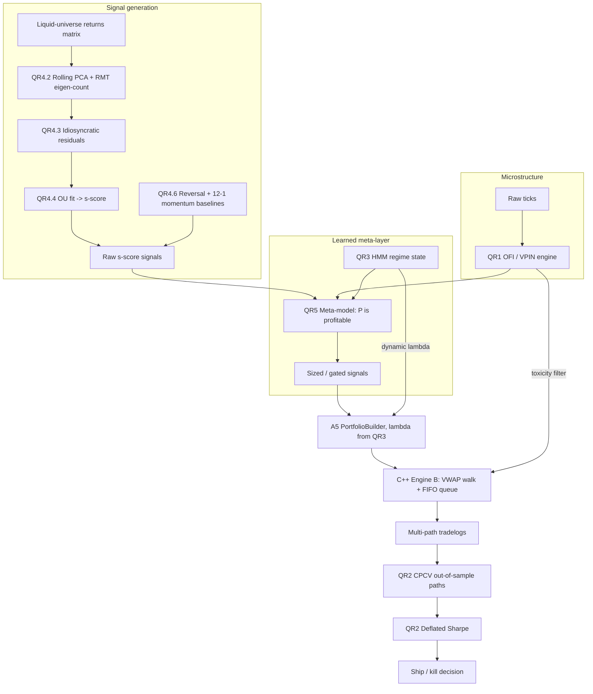

# QSE — Complete Phase Breakdown

*The Quantitative Strategy Engine: from Python-grade backtester to an
institutional-grade C++ trading system.*

This is the narrative companion to [TASK_BREAKDOWN.md](TASK_BREAKDOWN.md). The
breakdown is the execution checklist (chunks with pass/fail criteria); this
document explains **what each phase is, why it exists, how it was or will be
built, and what it proves** — including the phases that are already complete.

**Thesis research question:** *How much does market-microstructure realism —
a full-depth limit order book, VWAP fills, and queue position — change the
measured performance of trading strategies versus the fixed-slippage
assumptions of standard backtesters?*

**Sharpened by the QR track (Phases 12–16):** *…the measured performance of a
**cross-sectional statistical-arbitrage strategy** — and does anything survive
once its Sharpe is also **deflated for the number of configurations tested**?*

---

## System at a glance

```
                       ┌────────────────────────────────────────────┐
  data/*.csv ─────────►│ CSVDataReader / ParquetDataReader          │
  (bars & ticks)       └──────────────┬─────────────────────────────┘
                                      │ ticks
  ZeroMQ + protobuf ──► TickSubscriber┤
  (distributed mode)                  ▼
                       ┌────────────────────────────────────────────┐
                       │ Backtester ── BarBuilder ── BarRouter      │
                       │  (tick loop, per-symbol bars, mark-to-mkt) │
                       └──────┬─────────────────────────┬───────────┘
                              │ bars/ticks              │ orders
                       ┌──────▼──────────┐    ┌─────────▼───────────┐
                       │ IStrategy       │    │ OrderManager        │
                       │  SMA crossover  │    │  naive fills  ──or──│
                       │  Pairs trading  │    │  OrderBookFullDepth │
                       │  Factor / multi │    │  (FIFO queues, VWAP │
                       └─────────────────┘    │   walk, queue pos)  │
                                              └─────────┬───────────┘
                                                        │ equity/tradelog CSVs
                       ┌────────────────────────────────▼───────────┐
                       │ Python analysis: tearsheet.py,             │
                       │ impact_study.py, (slippage_audit.py)       │
                       └────────────────────────────────────────────┘
```

**Current scale:** ~19k ticks replayed in 24 ms (~800k ticks/s) on Apple
Silicon; 207 C++ tests + 16 Python tests; CI green on every push
(ubuntu-latest, GCC 13 + Arrow 24 at C++20, cross-checked against local
Apple clang at C++17).

---

## Phase 1 — Foundational Realism ✅

**Goal:** make the simplest backtest honest.

- **Transaction costs.** `OrderManager` applies per-trade commission and a
  slippage adjustment to every fill, so PnL is net of costs from day one. A
  naive SMA run on SPY loses ~$490 on $100k — a realistic outcome that a
  cost-free backtester would report as profit.
- **O(1) indicators.** The SMA crossover strategy uses rolling
  `MovingAverage` / `MovingStandardDeviation` accumulators (constant-time
  update per bar) instead of recomputing windows — the difference between
  O(n·w) and O(n) over a full backtest.
- **Auditable output.** Every run writes `equity_*.csv` (mark-to-market curve)
  and `tradelog_*.csv` (every fill with price, quantity, cash), which the
  entire Python analysis layer consumes.

**Proves:** understanding that backtest PnL without costs is fiction.

## Phase 2 — Performance Engineering ✅

**Goal:** measure before optimizing; keep receipts.

- Profiled the engine with **Instruments** to find real bottlenecks rather
  than guessing.
- Eliminated per-bar copies, pre-allocated vectors, and tightened the SMA
  hot path. Historical benchmark: the 6,444-bar SPY backtest ran in
  **~3.8 ms** after optimization.
- Before/after evidence lives in `docs/benchmarks/01–03_*.png`.

**Proves:** disciplined performance work — profile, change one thing, measure.

## Phase 3 — Advanced Architecture ✅

**Goal:** the three structural jumps that separate a script from a system.

- **3.1 Multi-asset parallelism.** A hand-rolled C++ `ThreadPool` runs
  independent per-symbol backtests concurrently (`multi_symbol_engine`,
  `multi_strategy_engine`).
- **3.2 Tick-driven core.** The `Backtester` consumes raw ticks;
  `BarBuilder` aggregates them into time bars on the fly and `BarRouter`
  dispatches per-symbol bars, so bar-driven strategies (SMA, pairs) run
  unchanged on tick data. Handles out-of-order ticks, bar boundaries, and
  end-of-stream flush — all unit-tested.
- **3.3 Distributed mode.** `data_publisher` and `strategy_engine` are
  separate executables connected by **ZeroMQ** pub/sub with **protobuf**
  serialization (`TickPublisher` / `TickSubscriber` / `ZeroMQDataReader`) —
  the standard shape of production market-data infrastructure.

**Proves:** concurrency, event-driven design, and distributed-systems layout.

## Phase 4 — Quantitative Modeling ✅ (far beyond original spec)

**Goal:** breadth beyond trend-following; the original plan asked for a
"simple factor model" — what exists is a full cross-sectional research stack.

- **4.1 Statistical arbitrage.** `PairsTradingStrategy`: spread z-score entry
  and exit with rolling hedge ratio; pair discovery and diagnostics in
  `scripts/analysis/find_pairs.py` and friends.
- **4.2 Multi-factor pipeline.** The chain runs
  `UniverseFilter → MultiFactorCalculator → CrossSectionalRegression
  (robust variants tested) → ICMonitor (information-coefficient tracking,
  distribution-tested) → AlphaBlender (IC-weighted signal blending with
  weight-sum property tests) → RiskModel (multi-asset beta/covariance) →
  PortfolioBuilder`. Factor data flows through **Apache Arrow/Parquet**
  tables; configuration is YAML; `compute_factors` is the standalone tool.
- **4.3 Portfolio optimization.** `PortfolioBuilder` is a constrained
  **quadratic-programming optimizer**: maximizes blended alpha subject to
  gross/net exposure caps and beta neutrality, with projection back to the
  feasible set. The A5 extension (2026-07-06) adds true **mean-variance**:
  `−λ/2·wᵀΣw` with the single-factor covariance Σ = σ_m²ββᵀ + diag(σ_resid²)
  from RiskModel, λ in YAML; λ=0 reproduces pure alpha-maximization exactly
  and the λ-sweep traces a textbook efficient frontier
  (`docs/research/factor/efficient_frontier.png`). `FactorStrategy` + `FactorExecutionEngine` turn target
  weights into delta orders behind a rebalance guard (no churn below
  threshold), from `WeightsLoader`-provided daily weight files.

**Proves:** the vocabulary and mechanics of modern quant research — factors,
IC, blending, risk models, constrained portfolio construction.

## Phase 5 — Market Microstructure ✅ (the thesis core)

**Goal:** replace "fills happen at the price you asked" with a real market.

- **5.1 Full-depth order book.** `OrderBookFullDepth`: price-ordered levels
  (bids descending, asks ascending), each level a **FIFO queue** of orders
  with per-order sizes, O(1) queue-position lookup via position maps, and
  stable queue IDs for cancellation.
- **5.2 Impact-priced market orders (A2).** Market orders **walk the book**:
  consume the best level, then the next, paying the volume-weighted average —
  so a 10,000-share order pays measurably more per share than a 100-share
  order against the same book. Selected per run by the `fill_model` config
  flag (`naive` vs `full_depth`), keeping the A/B comparison one config edit
  apart.
- **5.3 Queue-position-aware limit fills (A3).** Passive orders join the
  **back** of the queue at their price. Trade prints consume the queue
  FIFO — an order fills only after the displayed size ahead of it is
  exhausted. Marketable limits take liquidity up to their limit price and
  rest the remainder. Cancels remove orders from the queue. Displayed quote
  size re-enters at the **front** of its level on refresh (the conservative
  queue assumption forced by L1 data — the real queue is invisible). Maker
  fills are attributed even when one strategy order trades against another.
- **5.4 Empirical impact study (A4).** `impact_sweep` + `impact_study.py`
  sweep order sizes 50→51,200 through the book against real AAPL tick prices
  under two synthetic depth profiles and fit the impact law
  `slippage = a·Q^b`:

  | Depth profile | Fitted b | Theory | R² |
  |---|---|---|---|
  | uniform (equal size/level) | **1.017** | 1.0 | 0.9999 |
  | linear (deepening book)    | **0.569** | 0.5 (square-root law) | 0.9989 |

  The exponent *emerges* from liquidity distribution — the linear cost model
  every naive backtester assumes is exactly the uniform-depth special case,
  and real markets (square-root law) are not that case.

**Proves:** microstructure literacy — priority rules, adverse selection,
market impact — implemented, not just cited.

## Phase 6 — Data Quality & Analysis ✅

**Goal:** institutional-grade inputs and outputs.

- **6.1 Tearsheet ✅ (B3).** `scripts/analysis/tearsheet.py`: annualized
  Sharpe, max drawdown, CAGR, Calmar, annualized turnover, rolling Sharpe,
  and alpha/beta OLS vs a benchmark, rendered to a 3-page PDF. All metrics
  are pure functions with 16 pytest cases asserting hand-computed values to
  4 decimals. Building it exposed and fixed three real engine bugs: equity
  curves were never recorded, three failbit hacks silenced stdout in every
  qse binary (now opt-in `QSE_DEBUG=1` via `qse/core/Debug.h`), and the
  strategy engine never tagged ticks with a symbol.
- **6.2 Missing-data handling ✅ (B1).** `forward_fill_ticks` in the Python
  pipeline forward-fills prices, zeroes missing volumes, and reports every
  repair instead of silently dropping rows; `CSVDataReader` counts
  unparseable rows (one bad row no longer aborts a load) and surfaces
  time-grid holes via `gap_count()`, with a data-quality warning at load.
- **6.3 Corporate actions ✅ (B2).** `corporate_actions.py` back-adjusts
  splits and dividends from `config/corporate_actions.csv` (real split
  history for five names), with factors computed on the raw series and
  compounded correctly across multiple events. Verified against the AAPL 4:1
  split (2020-08-31): prices ÷4, volumes ×4, and a buy-and-hold equity curve
  flat across the split date where the raw series shows a fake −75% crash.

**Proves:** results you can hand to a PM, from inputs you can trust.

## Phase 7 — DevOps & Reproducibility ✅

**Goal:** engineering hygiene that survives other people's machines.

- **7.1 CI ✅ (C1).** GitHub Actions on every push/PR: Ubuntu runner installs
  Arrow/Parquet from the official apt repo plus protobuf/ZeroMQ/yaml-cpp,
  checks out the Eigen submodule, builds Release, runs the full ctest suite
  (~2.5 min). Because Arrow 24 forces C++20 on GCC while local builds are
  C++17 Apple clang, **every push is cross-checked against two compilers and
  two language standards** — this caught five classes of portability bugs on
  day one.
- **7.2 Repo hygiene ✅ (C4).** Untracked stale binaries and ctest logs;
  `git status` stays clean through a full build + test cycle.
- **7.3 Formatting ✅ (C2).** `.clang-format` + `black`/`flake8` enforced by a
  dedicated CI job with pip-pinned tool versions (identical output local and
  CI); one-time mechanical reformat of the whole tree, all suites green after.
- **7.4 Static analysis ✅ (C3).** `clang-tidy` gate (bugprone/performance/
  modernize-use-override, warnings-as-errors) over every built TU, pinned
  version, dedicated CI job. The clean-up fixed 49 findings including a real
  bug — a missing return on `WeightsLoader`'s Arrow-success path (UB) — and
  17 silently ignored Arrow `Status` returns.
- **7.5 Docker ✅ (D1).** Multi-stage `Dockerfile`: stage 1 compiles on the
  same ubuntu:24.04 + Arrow toolchain as CI, stage 2 ships binaries + runtime
  libs + the Python analysis stack. `docker run -v "$PWD/out:/results" qse`
  runs the SMA demo and writes equity curve, tradelog, and tearsheet PDF to
  the host — with metrics identical to the native macOS run, doubling as a
  cross-platform determinism check.

**Proves:** the difference between code that works here and software that
works anywhere.

## Phase 8 — Low-Latency Engineering ✅ (Track G)

**Goal:** hardware-sympathy — the layer trading firms actually interview on.

### 8.1 Custom memory management: the arena allocator ✅ (G1)

*The problem.* Every `new`/`malloc` walks OS heap structures in unpredictable
time — 10 ns on a good day, thousands when it triggers a page fault or
context switch. In trading, **jitter** (variance, not mean) is what loses the
trade; per-order heap allocation in the fill path is a fatal flaw.

*The build.* `qse::Arena` — a bump allocator: one large contiguous block
requested up front; each allocation returns the current offset and bumps it
by the object size (two instructions, perfectly predictable); **no individual
deallocation ever** — the whole arena resets in one operation when the
session ends. Implemented as a custom allocator or C++17
`std::pmr::monotonic_buffer_resource` with instrumentation, then plugged into
`OrderBookFullDepth`'s level containers via `std::pmr`.

*The payoff (measured 2026-07-05).* Raw allocation path: 57–70 ns/op heap →
**3.5 ns/op arena (16–20×)**, stable to ~0.1 ns run-to-run where the heap
varies — the determinism is the point. End-to-end order-book workload (2,000
books × 200 levels, build + VWAP walk + destroy): 139 µs → **58 µs/book
(2.4×)** even though allocation is only part of each iteration, because live
orders pack sequentially and the prefetcher streams them through L1/L2 during
book walks. Full numbers: `docs/benchmarks/04_arena_allocator.md`.

### 8.2 Lock-free multi-threading: the SPSC ring buffer (G2)

*The problem.* Live mode needs a network thread (feeding ticks) and a
strategy thread (trading on them). Guard the hand-off with a `std::mutex` and
the network thread blocks whenever the strategy holds the lock — a frozen
feed during the exact moments the market is moving.

*The build.* `qse::SPSCRingBuffer<T>` — a fixed power-of-two array that wraps
around; the producer owns an atomic `write_index`, the consumer owns an
atomic `read_index`; neither ever locks. Two hardware details carry the
design:
  - **False sharing.** CPUs move memory in 64-byte cache lines. If the two
    indices share a line, each core's write invalidates the other core's L1
    copy on every operation — a silent, catastrophic slowdown. `alignas(64)`
    forces the indices onto separate lines.
  - **Memory ordering.** The hand-off uses acquire/release semantics
    (`std::memory_order_acquire`/`release`) so the consumer never observes an
    index advance before the payload write, while each side reads its own
    index relaxed.

*The result (measured 2026-07-06).* Two 10M-item stress tests (strict
ordering + checksum) pass and ThreadSanitizer certifies both consumer paths
race-free. The benchmark (`docs/benchmarks/05_spsc_ring_buffer.md`) reports
the honest pair of findings: raw throughput is at *parity* with a mutexed
queue in item-at-a-time chase mode (~23M items/s — both designs are bound by
the same cross-core cache-line round-trip), while the ring wins where it
matters: with a consumer doing 200ns of work per tick, producer push latency
is p99 **42ns vs 16,334ns** for the locked design (389×), worst case 71µs vs
**1.15ms** (lock-holder preemption), and 1.75× total wall time from pipeline
overlap. Market-data hand-off is a tail-latency problem, and locks have
unbounded tails by construction. Integrated as `qse::LiveTickPipeline`
(ZeroMQ subscriber thread → ring → strategy thread, dropped ticks counted) —
the prerequisite for Phase 10's live feed, tested end to end over real
ZeroMQ.

**Proves:** cache lines, atomics, and allocation behavior — the exact
territory of a C++ trading-systems interview.

## Phase 9 — The Business Proof: A/B Slippage Audit ✅ (Track H)

**Goal:** convert all the infrastructure above into one financial number.

*The problem.* Standard backtesters assume infinite liquidity: "buy 5,000
shares" fills instantly at the close. In reality the order eats through the
book, pays VWAP degradation, and may wipe out the strategy's edge. The profit
difference between those two worlds is invisible — until you measure it.

*The build (H1).* Run the **exact same strategy on the exact same data**
through two engine configurations that already exist behind the `fill_model`
flag:
  - **Engine A (naive):** instant fills, fixed slippage — the
    infinite-liquidity assumption every tutorial backtester makes.
  - **Engine B (institutional):** the Phase 5 book — market orders walk
    levels and pay true VWAP, limit orders wait their turn in the FIFO queue.

Repeat across order-size regimes (1×, 10×, 50×). `slippage_audit.py` overlays
the paired equity curves; the gap between them is the **phantom profit** —
the dollar amount the naive backtest hallucinated. The report (built on the
Phase 6 tearsheet machinery) states it as the headline: *"the naive backtest
overstates this strategy's Sharpe by X% at size Y because it ignores queue
position and depth."*

*The result (measured 2026-07-05).* Identical SMA signals (455 per run),
deterministic and reproducible:

| Shares/signal | Naive PnL | Real PnL | Phantom $ | Phantom $/share | Naive Sharpe | Real Sharpe |
|---|---|---|---|---|---|---|
| 1,000 | −$10,011 | −$18,033 | $8,000 | $0.018 | −2.12 | −3.71 |
| 5,000 | −$7,887 | −$112,856 | $105,000 | $0.046 | −0.50 | −4.59 |
| 25,000 | **+$152,866** | **−$660,831** | **$813,700** | $0.072 | **+1.93** | **−5.26** |

At scale, the naive backtester reports a Sharpe-1.9 *winner*; the realistic
engine shows a heavy loser. Per-share phantom cost grows with size, so the
distortion is superlinear — worst exactly where a profitable-looking strategy
would scale into. Artifacts: `docs/research/microstructure/slippage_audit.pdf`
+ `ab_audit_summary.md`.

**Proves:** the intersection the whole project aims at — quantitative
research claims, validated or destroyed by systems engineering. This is the
artifact to hand across the interview table, and the results chapter of the
thesis.

## Phase 10 — Live Trading Integration ✅ (Track E)

**Goal:** demonstrate the engine is an execution system, not just a simulator.

- **10.1 `IExecutionHandler` ✅ (E1, done 2026-07-06).** Venue-agnostic
  contract (submit market/limit, cancel, replace, fill stream) shaped to map
  1:1 onto Alpaca's REST API; `SimulatedExecutionHandler` puts the real
  backtest fill engine behind it, verified equivalent to direct OrderManager
  use; gmock contract tests prove callers need only the interface.
- **10.2 Alpaca paper trading ✅ (E2, done 2026-07-06).**
  `AlpacaExecutionHandler` implements the E1 contract over the Alpaca paper
  REST API — submit/cancel/replace/query plus a polling fill stream —
  behind an injected `IHttpClient` (libcurl in production, gmock in tests,
  zero network in CI). Credentials only from the official APCA_* environment
  variables; the `alpaca_smoke --paper` tool performs the manual
  place-and-cancel dashboard verification.
- **10.3 Live mode ✅ (E3, done 2026-07-06).** The `live_engine` tool:
  Alpaca REST quote feed (producer thread; chosen over a websocket dependency
  — same architecture, transport swappable) → **SPSC ring buffer (Phase 8)**
  → `BarBuilder`/SMA strategy → `AlpacaExecutionHandler`, with local
  order/fill logs and an end-of-session per-order reconciliation against the
  venue. The engine is venue-agnostic (any drain source, any
  IExecutionHandler), so the strategy logic is identical between backtest and
  live — the entire point of event-driven design. Verified with mock-venue
  unit tests both ways (match and mismatch) plus a live market-hours
  session (2026-07-06): five crossover signals, five real paper fills, and a
  5/5 per-order reconciliation match against the venue.

**Proves:** full-stack capability — the same code path from historical CSV to
a live brokerage session.

## Phase 11 — Presentation & Thesis ⏳ (Track F)

**Goal:** make the work legible to recruiters, professors, and hiring managers.

**Ordering note:** the remaining items (11.2–11.4) land *after* the QR track
(Phases 12–16), so every presentation artifact tells the sharpened
survives-or-doesn't story rather than showcasing the pre-QR system while the
thesis tells the QR story. F2/F3 may be pulled forward only if built
strategy-agnostic (notebook loops over whatever strategies exist; one-pager
templated on the results ledger) — never hardcoded to the current SMA results.

- **11.1 Whitepaper README ✅ (F1, done 2026-07-06).** Full rewrite: findings
  table with every measured number, the A/B audit as the flagship section
  with committed figures, Mermaid architecture, engineering-quality evidence,
  and three quickstart paths (Docker, native, reproduce-the-research).
- **11.2 Notebook walkthrough (F2).** Jupyter demo: run the C++ engine,
  load results, render the tearsheet inline — executes clean via
  `nbconvert --execute`.
- **11.3 One-pager (F3).** Single PDF: architecture, key results, repo link.
- **11.4 Thesis write-up (F4).** 25–40 pages in `docs/thesis/`: introduction,
  related work (impact laws, queue models), system architecture (Phases 1–8),
  methodology (Phases 5, 9), results (impact exponents, phantom profit,
  Sharpe inflation), limitations (L1-reconstructed depth, no self-trade
  prevention, synthetic queue assumptions), future work.

**Proves:** communication — the skill that makes the other ten phases count.

---

## The QR track (Phases 12–16) — Quantitative Research & Signal Intelligence

*The research half of the artifact: everything above proves the engine tells
the truth about fills; this track builds strategies worth testing and the
statistical guardrails to trust the results. Execution checklist:
[TASK_BREAKDOWN.md](TASK_BREAKDOWN.md) Track QR.*

**The rule that governs the whole track.** "Profitable in Alpaca paper" is
not a result. Paper fills are optimistic — near-mid, instant, effectively
infinite liquidity — and the Phase 9 audit already measured what that hides:
identical SMA signals went from **+$153k / Sharpe 1.93** (naive) to
**−$661k / Sharpe −5.26** once orders walk the book at 25k shares/signal. So
the bar for every strategy in this track is:

> A strategy is *viable* only if it survives **Engine B** (VWAP-walk market
> orders + FIFO queue-position limit fills) **and** clears a Sharpe ratio
> that has been **deflated for the number of configurations tried**
> (Phase 13). Everything else is a candidate, not a result.

The honest headline being aimed for is not "I built a money printer." It is
**"after realistic fills and a Sharpe deflated for search, this survives /
does not survive"** — and a well-argued negative result is more credible to a
quant desk than a Sharpe-3 backtest they will assume is broken. The truth
serum (Phase 13) is built early so it judges everything, including the
machine-learning layer.

**Sequencing.** The phases are ordered by expected value, not by the original
proposal's numbering — build the one that can make money first, then the
thing that keeps it honest, then risk, then execution timing, then (only once
the honesty layer exists) the learned layer:

| Order | Phase | Item | Honest expectation |
|---|---|---|---|
| 1 | 12 (QR-P1) | QR4 eigen stat arb + baselines | **Realistic profit candidate.** Market-neutral, daily freq, documented edge — the one that could show net-positive PnL |
| 2 | 13 (QR-P2) | QR2 CPCV + Deflated Sharpe | **The credibility layer.** Judges QR4 and everything after; build before tuning anything |
| 3 | 14 (QR-P3) | QR3 HMM regime overlay | **Risk management, not alpha.** Cuts drawdown → lifts Sharpe by shrinking the denominator |
| 4 | 15 (QR-P4) | QR1 OFI / VPIN | **Execution filter, not a standalone signal.** Times entries / avoids toxic flow |
| 5 | 16 (QR-P5) | QR5 meta-labeling | **The one defensible use of ML here.** Sizes/gates bets; judged by Phase 13 |

**Where ML belongs (and where it doesn't).** The way ML usually enters a
trading project — a random forest or LSTM predicting next-period returns — is
exactly the failure mode Phase 13 exists to catch: returns have such low
signal-to-noise that flexible models memorize noise and report a beautiful
in-sample Sharpe that evaporates live. Naive ML would actively lower this
project's credibility. But three roles are legitimate here because **none of
them require predicting the direction of returns**: unsupervised regime
classification (Phase 14), meta-labeling that decides *whether to act and how
big* while the s-score decides the side (Phase 16), and feature importance
via MDA under purged CV (Phase 16). ML earns its place *only because
Phase 13 exists to keep it honest* — which is why Phase 16 is gated behind
Phase 13 by design.

**Architecture map (QR track):**



The elegant composition: **CPCV produces a distribution of out-of-sample
Sharpes**, and **DSR consumes that distribution's variance** plus the trial
count. They are built to fit together.

## Phase 12 — Alpha Discovery: Eigen Stat Arb + Baselines ✅ (QR-P1) 🎓

**Goal:** a flagship strategy that is market-neutral and resilient to
full-depth execution costs. Avellaneda-Lee residual reversion: rolling PCA on
a liquid universe, model each name's idiosyncratic residual as a
mean-reverting Ornstein-Uhlenbeck process, trade the standardized deviation
(s-score), stay dollar-neutral. **Prove it on 10–15 names before scaling to
100** — this keeps compute and debugging sane.

- **12.1 Universe + returns matrix ✅ (QR4.1, done 2026-07-06).** 15
  large-cap tech names (mean pairwise correlation 0.44 — real factor
  structure); raw Alpaca daily bars adjusted through B2 and cleaned
  B1-style with every repair counted; 1,432 × 15 standardized matrix with
  zero NaNs; the as-of alignment (trailing window, warm-up dropped, trade
  ≥ t+1) is documented in docs/research/statarb/ and enforced by a
  causality test — appending future data leaves emitted rows bit-identical.
- **12.2 Rolling PCA + principled factor count ✅ (QR4.2, done 2026-07-06).**
  Eigendecomposition of the rolling correlation matrix; retained-factor
  count from the **Marchenko-Pastur cutoff** `λ+ = (1 + √q)² = 2.25`, not an
  arbitrary constant. On the real universe the market eigenvalue clears the
  noise edge in every window (median 47.4% of variance); MP retains 1
  factor in 86% of windows and 2 in 14%, while the explain-55%-variance
  comparison rule wobbles between 1 and 4 — the arbitrariness MP removes.
  Block-matrix eigenvector recovery, pure-noise rejection, and causality
  all unit-tested; spectrum plot committed to docs/research/statarb/.
- **12.3 Idiosyncratic residuals ✅ (QR4.3, done 2026-07-06).** Per window,
  OLS-regress each name on the retained factor returns (one shared design for
  the whole cross-section); the residual is the idiosyncratic return and its
  cumulative sum `X_i = Σε_i` is the tradeable OU process QR4.4 fits. On the
  real universe, factors explain a median 50.9% of each name's variance
  (24–79%, tracking the market regime) — the other half is the tradeable
  residual — and residuals are orthogonal to the factors to 7×10⁻¹⁵. The
  intercept makes residuals both orthogonal *and* sum-to-zero in-window (so
  `X` ends at ~0); flagged and tested so QR4.4 builds the s-score from the OU
  fit of the path, not the endpoint. Committed diagnostics plot.
- **12.4 OU fit + s-score ✅ (QR4.4, done 2026-07-06).** Per window, an AR(1)
  fit of each name's cumulative residual backs out mean-reversion speed κ,
  equilibrium m, and equilibrium std σ_eq → the s-score. The **speed filter**
  rejects names whose reversion time exceeds ½·window (b→1, spurious). On the
  real universe the s-score comes out genuinely standardized (pooled mean
  0.01, std 0.95 — an end-to-end calibration check on the whole
  PCA→residual→OU chain), median half-life is 5.8 days so 99% of name-days
  pass the filter, and ~19% breach the ±1.25 bands. With QR4.3's sum-to-zero
  residuals the s-score reduces to −m/σ_eq (a large positive equilibrium →
  cheap name → buy); the estimators are tested against genuine OU paths with
  known parameters. Committed s-score distribution plot.
- **12.5 Dollar-neutral weights ✅ (QR4.5, done 2026-07-07).** A per-name
  hysteresis state machine on the s-scores (Avellaneda-Lee bands — ±1.25 open,
  asymmetric −0.50/+0.75 close — as *starting points*, the overfitting-prone
  knobs Phase 13 protects) drives a dollar-neutral daily book: each side
  equal-weighted to ±gross/2, net 0, gross cap, one-sided days flat. Emitted
  as `weights_YYYYMMDD.csv` in the exact format `WeightsLoader` / `FactorStrategy`
  consume, dated one trading day after the signal (the look-ahead-safe
  execution lag). On the real universe: 1,431 files, net to 1.4×10⁻¹⁶,
  gross = 1 on 94% of days, ~2.7 long / 2.3 short, 16% turnover. The
  Python→C++ handoff is proven in C++ — a gtest loads a book in this format
  through the real `WeightsLoader` and checks net ≈ 0.
- **12.6 Cheap baselines ✅ (QR4.6, done 2026-07-07).** Cross-sectional
  short-term reversal and 12-1 momentum, built in the same Python harness so
  all three emit the identical dollar-neutral weight-file format (the baselines
  reuse QR4.5's weight construction unchanged). The cost-free floor is already
  a finding: **stat arb (0.97) only ties plain momentum (0.99)** and both clear
  reversal (−0.28) — so the elaborate machinery has to earn its keep on
  *net-of-cost* Sharpe, where its 16% turnover vs momentum's 4% is the swing
  factor QR4.7 measures. Provisional until Engine B (QR4.7) and DSR (Phase 13).
- **12.7 Survive Engine B ✅ (QR4.7, done 2026-07-07).** The `statarb_audit`
  tool runs all three strategies' weight files through the real OrderManager
  fill models at 1×/10×/50× — Engine A (naive) vs Engine B (full-depth VWAP
  walk), the daily analogue of the Phase 9 H1 audit. **The result is a
  credible negative:** under Engine B at 50×, net Sharpe is momentum 0.84 >
  stat arb 0.69 > reversal −0.71 — cheap 12-1 momentum *beats* the elaborate
  eigen stat arb once fills are charged, because the stat arb's 16% turnover
  bleeds 17–25% phantom cost against momentum's 4%/~6%. The fancy machinery
  does not earn its complexity over a one-line rule. Provisional — a
  candidate, not a result — until Phase 13 deflates it for the parameter
  search.

**Phase 12 (QR-P1) is complete:** the industry-standard market-neutral
stat-arb pipeline end to end — RMT-based factor selection, OU residual
modeling, dollar-neutral construction — judged against realistic fills and
cheap baselines, with an honest provisional finding. The credibility layer
that turns "provisional" into "judged" is Phase 13.

**Proves:** the industry-standard market-neutral stat-arb pipeline end to
end — RMT-based factor selection, OU residual modeling, dollar-neutral
construction — judged against realistic fills and cheap baselines.

## Phase 13 — The Truth Serum: CPCV + Deflated Sharpe ✅ (QR-P2) 🎓

**Goal:** prove Phase 12 (and everything after) is not overfit. Financial
time series have heavy serial correlation, so vanilla k-fold CV leaks the
future into the past; and if you test 1,000 threshold combinations, the best
is almost always a fluke. Two composing pieces: **Combinatorial Purged CV**
(the machinery) and the **Deflated Sharpe Ratio** (the headline metric) —
the difference between "I found a Sharpe-2 strategy" and "I found a Sharpe-2
strategy that survives correction for having tried 400 variants."

- **13.1 Purge + embargo ✅ (QR2.1, done 2026-07-07).** The López de Prado
  leak fixes (AFML ch. 7) on integer bar positions: purge drops training
  samples whose information window overlaps any test window (symmetric — both
  leak directions); embargo drops `int(n·embargo_pct)` samples immediately
  after each test region against serial correlation. Built general (arbitrary
  information windows) so CPCV and QR5's triple-barrier labels reuse it; 12
  pytest cases prove no residual overlap and exact-fraction embargo.
- **13.2 Combinatorial paths ✅ (QR2.2, done 2026-07-07).** N blocks, k test → C(N,k) splits,
  recombined into C(N−1,k−1) complete out-of-sample equity curves — a
  *distribution* of Sharpes, not a point estimate.
- **13.3 Trial registry ✅ (QR2.3, done 2026-07-07).** Every backtest variation logs params
  **and its return series**; the DSR is only meaningful if trial count and
  dispersion are real.
- **13.4 PSR → DSR ✅ (QR2.4, done 2026-07-07).** The Probabilistic Sharpe Ratio (accounts for
  return skew/kurtosis and sample length), then the Deflated Sharpe with the
  benchmark set to the expected max Sharpe under the null across N trials.
  Acceptance test: **100 random-noise strategy variations must severely
  deflate the final DSR** vs a single-hypothesis run.
- **13.5 Wire Phase 12 through it ✅ (QR2.5, done 2026-07-07).** A 12-config
  sweep of QR4's bands × window, logged to the registry and deflated: the
  Avellaneda-Lee default won (cost-free Sharpe 0.92, PSR(0) 0.987) but
  **DSR = 0.610** — the best per-period Sharpe (0.058) barely clears the null's
  expected max (0.051). It survives the search correction only modestly, and
  cost-free; the Engine B haircut applies on top. QR4's tearsheet
  (docs/research/statarb/qr4_dsr_summary.md) now carries the DSR line and N=12.

**Proves:** understanding of the single most important trap in quant research
— and the machinery (purging, embargo, combinatorial paths, deflation) to
avoid it. This is the section a skeptical PM checks first.

**Phase 13 (QR-P2) is complete** — the truth serum end to end. Every Sharpe the
track reports (including the QR-P4/P5 layers still to come) can now be deflated
for the search that produced it.

## Phase 14 — Risk Architecture: HMM Regime Overlay ✅ (QR-P3)

**Goal:** detect volatility regime shifts and de-risk into them — the overlay
scales the A5 risk-aversion λ toward minimum-variance when the market turns.
**Honest expectation:** regime models detect the regime *after* it's underway
and overfit easily, so don't expect added return; what they reliably do is
**cut drawdown**, lifting Sharpe by shrinking the denominator — a legitimate
gain, correctly attributed.

- **14.1 Causal regime features ✅ (QR3.1, done 2026-07-07).** Rolling realized vol, spread
  expansion, volume profile — all strictly as-of, with a no-look-ahead test.
- **14.2 Gaussian HMM, fit causally ✅ (QR3.2, done 2026-07-08).** States discovered then labeled
  by inspection (sorted by emission variance); the "crash" state may or may
  not emerge — report honestly. **The correctness trap:** live use takes
  **filtered** state probabilities (info up to t) — Viterbi/smoothed states
  see the whole series and are a look-ahead bug that silently inflates most
  published regime backtests. Verified by a test that appending future data
  does not change the state at t.
- **14.3 Anti-whipsaw ✅ (QR3.3, done 2026-07-08).** Minimum dwell time / hysteresis so λ only
  moves on persistent state changes.
- **14.4 Integration with A5 λ ✅ (QR3.4, done 2026-07-08).** State → λ mapping in YAML; a gtest
  confirms a state change forces the C++ engine toward min-variance / lower
  gross; a notebook plots the SPY equity curve colored by regime.

**Proves:** regime models treated as risk control (their real job), an
unsupervised ML model integrated into a live risk parameter, and the
look-ahead trap avoided.

## Phase 15 — Execution Intelligence: OFI / VPIN ✅ (QR-P4)

**Goal:** use microstructure features to *time entries* and avoid crossing
the spread into toxic, one-sided flow — measured by whether it improves fills
in the A/B audit. Reframed from standalone alpha for two concrete reasons:
faithful OFI needs real L2/L3 depth updates and this system's depth is
**L1-reconstructed**; and the OFI edge decays in *seconds* while the fill
path is REST polling at hundreds of ms. As an execution-timing filter in
`OrderManager`, it plays straight to the systems strength.

- **15.0 The depth-data fork, settled first ✅ (QR-Data, done 2026-07-08).**
  **Decided: stay on L1-reconstructed depth** — the only inputs are L1 trade
  prints + daily OHLCV (no quote/depth feed), the OFI edge decays in seconds
  vs a 100s-of-ms REST fill path, and real MBO is out of scope. Consequence:
  OFI/VPIN are scoped as an execution-timing / toxicity filter judged by fill
  improvement in the A/B audit, **not** a standalone "OFI predicts price"
  alpha. The decision and caveat are written into `docs/thesis/limitations.md`
  §1 (which now also consolidates the project's other honest caveats).
- **15.1 OFI engine ✅ (QR1.1, done 2026-07-08).** Order-flow imbalance from conditional bid/ask
  size changes per tick interval, gtest-verified on a hand-built sequence.
- **15.2 VPIN engine ✅ (QR1.2, done 2026-07-08).** Equal-volume buckets, bulk-volume
  classification through the normal CDF, rolling mean of the buy/sell volume
  imbalance.
- **15.3 Toxicity filter in `OrderManager` ✅ (QR1.3, done 2026-07-08).**
  `OrderManager` reads a running OFI/VPIN toxicity signal from its tick stream;
  the `ToxicityFilter` rests passive (delays crossing) only when flow is toxic
  *and* directionally favorable. The `toxicity_audit` tool ran the gated policy
  vs blind market orders on the AAPL stream — **and the audit decided against
  it.** The filter *raises* average slippage (0.0117 vs blind 0.0100): 27/34
  rested orders capture the spread, but the 7 fallbacks get picked off after the
  toxic flow runs away (avg +$0.54), swamping the captures — robust across every
  threshold/horizon. An honest negative: high VPIN predicts *continued* adverse
  movement, so resting passive into it is the wrong move.

**Proves:** microstructure literacy applied where it actually pays for
retail-grade data — execution timing — and honesty about what
L1-reconstructed depth can and can't support.

## Phase 16 — Learned Meta-Layer: Meta-Labeling ⏳ (QR-P5) 🎓

**Goal:** the ML capstone that consumes the other four phases. The primary
model (Phase 12's s-score) still decides the *side*; a classifier decides
*whether to act and how big*, trained on regime state (Phase 14), VPIN/OFI
(Phase 15), s-score magnitude, spread, and vol. This is López de Prado's
**meta-labeling** — it improves precision and sizes bets **without ever
predicting direction**, which is why it survives where return-prediction ML
doesn't. Deliberately last: it is only trustworthy under purging/embargo, so
it is gated behind Phase 13 by design.

- **16.1 Triple-barrier labels ✅ (QR5.1, done 2026-07-09).** Profit-take / stop / time-limit
  barriers per entry signal; the meta-label is whether the primary bet would
  have been profitable.
- **16.2 Sample uniqueness ✅ (QR5.2, done 2026-07-09).** Overlapping label windows violate IID —
  weight samples by average uniqueness / sequential bootstrap.
- **16.3 Meta-model under purged CV ✅ (QR5.3, done 2026-07-09).** Simple classifier (logistic /
  gradient-boosted trees, not a deep net) predicting P(profitable), validated
  only through Phase 13's CPCV.
- **16.4 Probability → size / gate ✅ (QR5.4, done 2026-07-09).** P(profitable)
  mapped to bet size (or a skip-gate), re-emitted in the same weight-file format
  the engine consumes, toggleable off/gate/size for A/B — **meta-off reproduces
  the raw QR4.5 book bit-for-bit** (the baseline); gate/size at floor 0.5 cut the
  book from 1,338 to 301 active days. Whether that helps net-of-cost is QR5.5's
  DSR verdict.
- **16.5 Judged like everything else (QR5.5).** Meta-on vs meta-off under
  Engine B with DSR for both; feature importance via MDA under purged CV
  ranks which features actually carried information.

**Proves:** the mature use of ML in quant — meta-labeling, triple-barrier,
sample uniqueness, purged feature importance — with the discipline to gate it
behind the same statistical guardrails as everything else. A "clearly read
AFML and applied it correctly" signal, which is rare.

### Optional extension — Hierarchical Risk Parity

Same intellectual spirit, small scope: HRP clusters the correlation matrix
and allocates by recursive bisection, avoiding the unstable matrix inversion
mean-variance needs for near-singular covariance. **A5 MVO vs HRP
out-of-sample** on the Phase 12 universe is a clean, self-contained research
question, judged under CPCV like everything else.

---

## Results ledger (updated as phases land)

| Evidence | Value | Where |
|---|---|---|
| Tick replay throughput | ~800k ticks/s (19,184 ticks / 24 ms) | strategy_engine |
| Historical bar-backtest benchmark | ~3.8 ms / 6,444 bars | docs/benchmarks |
| Impact exponent, uniform depth | b = 1.017 (theory 1.0), R² 0.9999 | docs/research/microstructure |
| Impact exponent, linear depth | b = 0.569 (theory 0.5), R² 0.9989 | docs/research/microstructure |
| C++ tests | 207 (ctest, mac + Linux CI) | tests/cpp |
| Python tests | 16 (pytest, hand-computed metrics) | tests/python |
| CI wall time | ~2.5 min per push | GitHub Actions |
| Phantom profit at 25k sh/signal | $813,700 (naive Sharpe +1.93 vs real −5.26) | docs/research/microstructure |
| Arena vs heap allocation | 3.5 ns/op vs 57–70 ns/op (16–20×); book workload 2.4× | docs/benchmarks/04 |
| SPSC ring vs locked queue | p99 push 42ns vs 16,334ns (389×); max 71µs vs 1.15ms; TSan clean | docs/benchmarks/05 |

### QR-track ledger (targets — fill in as Phases 12–16 land)

| Evidence | Target | Where |
|---|---|---|
| QR4 net Sharpe under Engine B | ✅ 0.69 (50×); clean negative vs momentum | docs/research/statarb |
| QR4 vs reversal/momentum baselines | ✅ momentum 0.84 > stat arb 0.69 > reversal −0.71 net of costs | docs/research/statarb |
| DSR of chosen QR4 config | ✅ DSR 0.61, deflated for N=12 trials (cost-free) | docs/research/statarb/qr4_dsr_summary.md |
| CPCV multiple-testing penalty | ✅ 100 noise variants: PSR(0) 0.99 → DSR 0.47 | docs/research/validation |
| HMM regime overlay | ✅ causal filtered HMM (calm/elevated/turbulent) → debounce (81→28 switches) → A5 λ; turbulent regime provably lowers portfolio variance + gross (gtest) | docs/research/regime |
| OFI/VPIN filter | ❌ honest negative: filter *raises* slippage (0.0117 vs 0.0100) — adverse selection on fallback (avg +$0.54) swamps the spread capture, robust across configs | docs/research/execution |
| Meta-layer | meta-on vs meta-off DSR under Engine B | docs/research/statarb |
