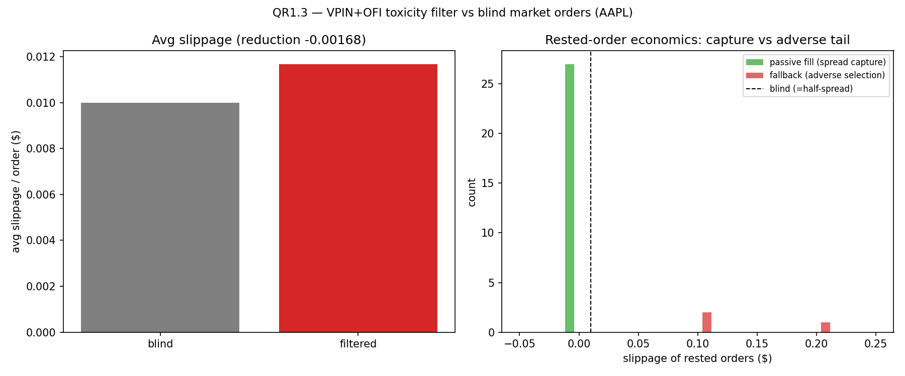

# Execution Intelligence (QR-P4) — OFI / VPIN toxicity filter

Reframed from standalone alpha to an **execution-timing filter** (QR-Data,
[thesis limitations §1](../../thesis/limitations.md)): our depth is
L1-reconstructed and the fill path is REST at hundreds of ms, so microstructure
features are used to *time entries* and avoid crossing the spread into toxic,
one-sided flow — measured by whether they improve fills in the A/B audit, not by
predicting price.

Build order: QR-Data (settled) → QR1.1 OFI engine → QR1.2 VPIN engine →
QR1.3 toxicity filter in `OrderManager`.

## QR1.1 — OFI engine ✅

[`include/qse/microstructure/OFICalculator.h`](../../../include/qse/microstructure/OFICalculator.h)
(header-only; verified by `tests/cpp/OFITest.cpp`, 11 gtests). Order Flow
Imbalance (Cont-Kukanov-Stoikov) on L1 quotes: per event (two consecutive
snapshots) `OFI = ΔV_bid − ΔV_ask`, where each side's contribution is
conditional on how its price moved:

| bid moves | contribution | ask moves | contribution |
|---|---|---|---|
| up | **+**new bid size (demand steps up) | up | **+**prior ask size (supply withdrawn → bullish) |
| down | **−**prior bid size (demand withdrawn) | down | **−**new ask size (new supply → bearish) |
| flat | new − prior size (Δ) | flat | −(new − prior) size |

Positive OFI = net buying pressure. Sizes are cast to `double` before
differencing so the unsigned `Volume` (uint64) never underflows on a shrinking
level. `OFICalculator` keeps a rolling-window sum for use as a live
`OrderManager` filter (QR1.3); `event_ofi(...)` is a pure static for reuse.

**Verified (the done-when):** a hand-built tick sequence with known level
changes reproduces the per-event OFI and the running sum. Each of the six
price-move cases (bid/ask × up/down/flat) is checked in isolation, plus a
shrinking-size case (no unsigned underflow), a combined bullish event, the
rolling-window eviction, first-snapshot-has-no-event, and reset.

**Scope caveat.** Computed on L1-reconstructed quotes, so this is a
toxicity/execution-timing signal, not an "OFI predicts price" alpha — see
[limitations §1](../../thesis/limitations.md).

### Reproduce

```bash
./build/run_tests --gtest_filter='OFITest.*'
```

## QR1.2 — VPIN engine ✅

[`include/qse/microstructure/VPINCalculator.h`](../../../include/qse/microstructure/VPINCalculator.h)
(header-only; verified by `tests/cpp/VPINTest.cpp`, 9 gtests). Volume-synchronized
Probability of Informed Trading (Easley-López de Prado-O'Hara 2012) — toxicity
of order flow measured in *volume* time:

1. **Equal-volume buckets** — trades accumulate into buckets of exactly
   `bucket_volume` shares; a large trade is split across buckets.
2. **Bulk-volume classification** — the price change between consecutive bucket
   closes is standardized and pushed through the normal CDF: `V_buy = V·Φ(ΔP/σ)`,
   `V_sell = V − V_buy`.
3. **VPIN** = mean over the last `num_buckets` buckets of `|V_buy − V_sell| / V`
   = mean of `|2·Φ(ΔP/σ) − 1|`.

σ (the volatility of bucketed price changes) is estimated causally as the
expanding sample std of ΔP, or a `fixed_sigma` may be supplied. Balanced flow
(ΔP ≈ 0) → VPIN ≈ 0; one-sided flow (large |ΔP|/σ) → VPIN ≈ 1. `Φ` uses `erfc`
for tail accuracy; the static `buy_fraction` / `order_imbalance` are exposed for
reuse.

**Verified (the done-when):** VPIN on a synthetic volume series with a known
buy/sell split — alternating ±1σ closes give VPIN = `|2Φ(1) − 1|` ≈ 0.683 exactly
(fixed σ) and within tolerance under the estimated-σ path. Plus: normal-CDF
values, buy-fraction/imbalance (incl. σ ≤ 0 → balanced), equal-volume bucketing
with trade splitting, balanced-flow → 0, one-sided-flow → ~1, not-ready-until-n,
and reset.

## QR1.3 — Toxicity filter in `OrderManager` ✅

`OrderManager` now reads the running OFI/VPIN toxicity signal from its own tick
stream (`enable_toxicity_filter` → fed in `process_tick` → `current_vpin()`,
`current_ofi()`, `is_toxic()`; additive, no change to the fill path), and
[`ToxicityFilter`](../../../include/qse/microstructure/ToxicityFilter.h) is the
decision policy: **rest passive (delay crossing) only when flow is toxic (VPIN >
threshold) AND directionally favorable** (a buy wants net selling, OFI < 0, to
come hit its bid). Gating on direction *and* toxicity is deliberate — resting
into same-direction toxic flow would just miss the fill.

**The A/B audit decides.** `toxicity_audit` (tool) + `toxicity_audit.py`
(analysis) run a schedule of AAPL orders two ways on the same tick stream —
blind market orders vs the VPIN+OFI-gated passive policy (rest passive when
toxic-favorable, wait up to W ticks for a passive fill, else fall back to
crossing) — and measure per-order slippage vs the arrival mid.



**Result — a robust negative (the honest finding):** on 1,893 orders the filter
*increases* average slippage (0.01168 vs blind's 0.01000). The decomposition
([summary](toxicity_audit_summary.md)): of the 34 rested orders, 27 (79%) fill
passively and capture the spread (−$0.01 each), but the 7 that don't fall back
after the toxic flow has **run away** — average slip **+$0.54**, a catastrophic
adverse-selection tail that swamps the captures. The pattern holds across every
threshold (0.45–0.7) and horizon (10–40 ticks) tested. The microstructure
lesson: on 1-minute AAPL, high VPIN predicts *continued* adverse movement, so
resting passive into it is the wrong move — you only get filled when the flow
reverses. **The filter does not earn its place on this data.** (Any win from
sweeping the config would itself need DSR deflation — QR-P2.)

**Verified:** 7 `ToxicityFilterTest` gtests — the decision policy (benign →
cross, toxic+favorable → rest, toxic+adverse → cross, strict threshold) and
`OrderManager` flagging one-sided flow toxic / flat flow benign / disabled by
default — plus 4 pytest cases on the analysis (reduction sign, passive-vs-
fallback decomposition, verdict text).

### Reproduce

```bash
./build/run_tests --gtest_filter='ToxicityFilterTest.*'
./build/toxicity_audit                                  # blind vs filtered on AAPL ticks
venv/bin/python scripts/analysis/toxicity_audit.py      # summary + plot
venv/bin/python -m pytest tests/python/test_toxicity_audit.py -q
```

## QR-P4 complete

QR-Data (L1 decision) → QR1.1 OFI → QR1.2 VPIN → QR1.3 toxicity filter. The
microstructure literacy is real (OFI, VPIN, bulk-volume classification, a
VPIN+OFI execution gate wired into `OrderManager`), and — faithful to the whole
track — the honest result is that a naive toxicity filter on L1-reconstructed
depth **does not** improve fills. The audit decided, and it decided against.
