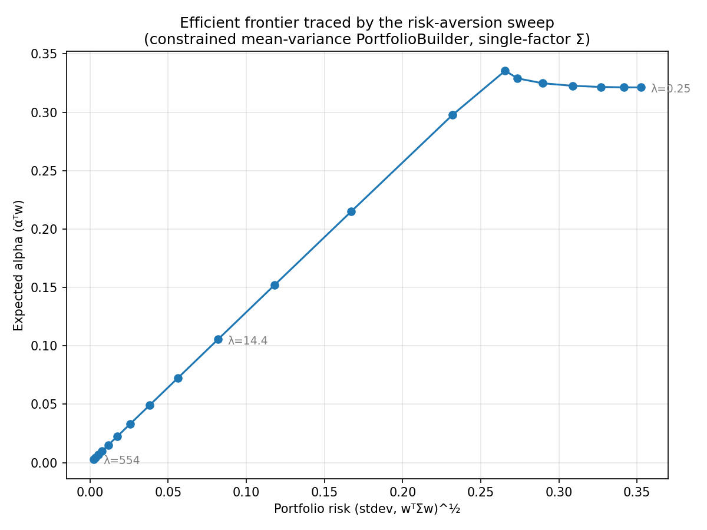

# Efficient Frontier — Mean-Variance PortfolioBuilder (A5)

*Generated 2026-07-06 by `scripts/analysis/efficient_frontier.py`*

Sweeping the risk-aversion parameter λ through the constrained
optimizer traces the efficient frontier of the synthetic 8-asset
universe (single-factor covariance Σ = σ_m²ββᵀ + diag(σ_resid²),
net-zero / gross-cap / beta-neutral constraints active):

| | λ | expected alpha | risk (stdev) | gross |
|---|---|---|---|---|
| alpha-seeking end | 0.25 | 0.3213 | 0.3525 | 4.00 |
| min-variance end | 554 | 0.0030 | 0.0023 | 0.03 |

Both risk and expected alpha decrease monotonically in λ — the
textbook frontier shape, produced by the same projected-gradient
optimizer the factor pipeline uses in production, with λ = 0
reproducing the legacy pure-alpha behavior exactly
(`MeanVarianceTest`).

