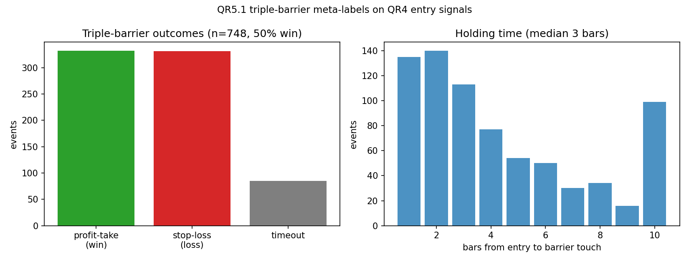

# Learned Meta-Layer (QR-P5) — meta-labeling

The one defensible ML addition, and the capstone. QR4's s-score still decides
the **side** of each bet; a classifier decides **whether to act and how big**,
trained on features from QR1 (VPIN/OFI), QR3 (regime), and s-score magnitude —
López de Prado meta-labeling, which improves precision and sizes bets **without
ever predicting the direction of returns**. That is why it survives where
return-prediction ML doesn't, and why it is gated behind QR-P2: it is only
trustworthy validated under purging/embargo and judged by the same DSR.

Build order: QR5.1 triple-barrier labels → QR5.2 sample uniqueness →
QR5.3 meta-model under purged CV → QR5.4 probability → size/gate →
QR5.5 judge it (Engine B + DSR + MDA feature importance).

## QR5.1 — Triple-barrier labels ✅

[`scripts/research/meta/triple_barrier.py`](../../../scripts/research/meta/triple_barrier.py)
(verified by `tests/python/test_triple_barrier.py`, 12 cases). For each QR4
entry event (t0, entry price p0, side s) three barriers are placed on the return
*in the bet's direction*, `signed = s·(pₜ/p0 − 1)`:

- **upper (profit-take):** first bar with `signed ≥ pt` → **label 1** (win)
- **lower (stop-loss):** first bar with `signed ≤ −sl` → **label 0** (loss)
- **vertical (time limit):** neither within `max_holding` bars → label by the
  sign of `signed` at the horizon

Whichever is touched first wins. The touch time `t1` is not just for the label:
`[t0, t1]` is the observation's **information window**, so QR2.1 purge/embargo
and QR5.2 sample uniqueness consume the emitted `t0_idx`/`t1_idx` directly
(`label_windows`). `apply_triple_barrier` is generic over the input series —
prices to label the realized bet, or a residual/cumulative series to label the
idiosyncratic reversion the s-score targets (QR5.3's choice).

### On the real QR4 signals



Labeling all 748 QR4 entry events (pt = sl = 3%, 10-bar horizon) on each name's
price path: **332 profit-take / 331 stop-loss / 85 timeout**, a meta-label
balance of **0.497** (≈50% wins) and a **median 3-bar** holding — consistent
with the ~5-day OU half-life. The near-even win rate is itself the motivation
for meta-labeling: the s-score picks the side but is barely better than a
coin-flip on *which* bets pay, so a classifier that can rank the winners has
room to add precision. Balanced labels are also clean training targets (no class
imbalance to fight).

**Verified (the done-when):** barrier-touch labeling on hand-built price paths —
up-first (profit-take → win), down-first (stop → loss), and timeout (labeled by
sign) — plus the short side, first-touch precedence when both barriers would
eventually hit, exact-threshold touches, horizon clamping at the series end, and
the entry-event extraction (opens and long↔short flips, holds skipped) that
feeds it.

### Reproduce

```bash
venv/bin/python -m pytest tests/python/test_triple_barrier.py -q
```

## QR5.2 — Sample uniqueness ✅

[`scripts/research/meta/sample_uniqueness.py`](../../../scripts/research/meta/sample_uniqueness.py)
(verified by `tests/python/test_sample_uniqueness.py`, 12 cases). The QR5.1
label windows overlap — two entries a day apart, each held ten bars, share nine
bars of outcome — so their labels are not IID and clusters of redundant samples
would dominate training. The fix (López de Prado, AFML ch. 4):

- **concurrency** `c_t` = number of label windows active at bar t
- **average uniqueness** `ū_i` = mean over event i's span of `1/c_t` ∈ (0, 1] —
  an isolated event has ū = 1; one buried in a cluster of k concurrent events
  has ū ≈ 1/k

`sample_weights` uses ū (optionally scaled by |return|, AFML's return
attribution) as the classifier `sample_weight`, normalized to average 1.
`sequential_bootstrap` is the complement — draw samples favoring those least
overlapping with what's already drawn, for a more-diverse bootstrap.
`weights_for_labels` wraps a QR5.1 labels frame, computing uniqueness within
each name (cross-name same-time overlap is on different residual paths, so not
concurrent).

**On the real labels:** the 748 QR4 entries are mostly non-overlapping (mean
uniqueness 0.984 → effective N ≈ 736/748, weights 0.44–1.02), so here it's a
modest but principled correction — the s-score entries are sparse per name.

**Verified (the done-when):** heavily-overlapping samples get lower weight than
isolated ones (a triple-overlap cluster → ū = 1/3 each vs an isolated ū = 1).
Plus concurrency counts, the unit-interval bound, identical/partial overlap,
return-attribution scaling, normalization, the sequential bootstrap
over-sampling the unique event (>25% vs uniform's 17%), and a regression for
duplicate-index pooled frames.

## QR5.3 — Meta-model under purged CV ✅

[`scripts/research/meta/meta_model.py`](../../../scripts/research/meta/meta_model.py)
+ [`build_meta_dataset.py`](../../../scripts/research/meta/build_meta_dataset.py)
(verified by `tests/python/test_meta_model.py`, 11 cases). The track converges
here: a classifier predicts **P(the primary bet is profitable)** from features
that never encode the direction of returns — `abs_sscore`, `sscore`, `kappa`,
regime (QR3.3), trailing vol (21/5), a daily order-flow proxy (`vol_ratio`), and
day-of-week — trained on the QR5.1 labels, weighted by QR5.2 uniqueness, and
validated **only** through purged CPCV.

**The harness** composes the QR2 machinery on the *events'* windows:
`purged_cpcv_splits` orders events by entry time, partitions them into N groups,
takes every k-subset as a test fold (C(N,k) splits), and purges (QR2.1 — drop
train events whose `[t0, t1]` overlaps a test window) + embargoes on the bar axis
(QR2.1's own embargo assumes obs-index == bar-index, false for custom windows, so
the bar-space embargo lives in `meta_model`). The classifier is a dependency-free
weighted logistic regression (gradient-boosted trees are a drop-in upgrade).

**On the real data — an honest null (a preview of QR5.5's DSR verdict):** 743
meta-labeled events × 8 features, label balance 0.498. Under purged CPCV (6
groups, k=2 → 15 splits, 3,715 out-of-sample predictions) the meta-model's CV
accuracy is **0.500 vs a 0.502 majority baseline** — *no predictive edge*. These
daily features don't tell winning QR4 bets from losing ones when validated
leak-free. That is exactly the point of building the guardrails: a naive
(leaking) CV might have shown a flattering number; purged CPCV keeps it honest.

**Verified (the done-when):** the model trains through the purged CPCV harness,
and **no train/test fold overlaps** — the event sets are disjoint *and* no train
event's information window overlaps a test event's (brute-forced across
(N,k) ∈ {(6,2),(8,3),(5,2)}), with the correct split count, every event tested
C(N−1,k−1) times, the bar-embargo dropping post-test entries, and end-to-end
training that predicts every test event deterministically. Plus the logistic
regression itself (learns a separable pattern, weighted fit shifts the boundary,
probabilities in [0,1]).

### Reproduce

```bash
venv/bin/python scripts/research/meta/build_meta_dataset.py   # dataset + purged-CV metrics
venv/bin/python -m pytest tests/python/test_meta_model.py -q
```

## QR5.4 — Probability → size / gate ✅

[`scripts/research/meta/meta_sizing.py`](../../../scripts/research/meta/meta_sizing.py)
(verified by `tests/python/test_meta_sizing.py`, 8 cases). The meta-model's
P(profitable) becomes the *size* of each bet, re-emitted in the same
`weights_YYYYMMDD.csv` format the C++ engine consumes — a drop-in the QR5.5 A/B
audit toggles:

- **off** — size 1 for every bet → **reproduces the raw QR4.5 book exactly**
  (the A/B baseline)
- **gate** — size 1 if P ≥ floor else 0 → skip low-confidence bets
- **size** — `clip((P − floor)/(1 − floor), 0, 1)` → confidence-weighted ramp

The meta-decision is made at entry and held for the position's life, so a
per-event size propagates over its whole run in the QR4.5 position frame. The
fractional positions are made dollar-neutral by allocating each side in
proportion to its sizes — which **collapses to QR4.5's equal weighting when all
sizes are 1**, so meta-off is provably the baseline. The leak-free P per event
is the pooled purged-CPCV out-of-sample prediction (QR5.3).

**On the real book:** off → 1,338 active days (= the raw QR4.5 book); gate/size
at floor 0.5 → **301 active days** (77% fewer). Since the meta-model has no CV
edge (QR5.3), the gate at 0.5 is effectively dropping ~half the bets at
random — whether that helps or hurts net-of-cost is what QR5.5 measures.

**Verified (the done-when):** the meta-layer emits the same weight-file format
(header + `symbol,weight`, |w| ≤ 10, net ~0), and the mode flag toggles sizing —
**meta-off is bit-equal to the raw QR4.5 `weights_from_positions`** book; gate
skips sub-floor bets; size scales by confidence; sizes propagate over the held
run; and dollar-neutrality holds for fractional sizes.

### Reproduce

```bash
venv/bin/python scripts/research/meta/meta_sizing.py --mode off    # = QR4.5 baseline
venv/bin/python scripts/research/meta/meta_sizing.py --mode gate --floor 0.5
venv/bin/python scripts/research/meta/meta_sizing.py --mode size --floor 0.5
venv/bin/python -m pytest tests/python/test_meta_sizing.py -q
```

## QR5.5 — Judge it (Engine B + DSR + MDA) — *next*
