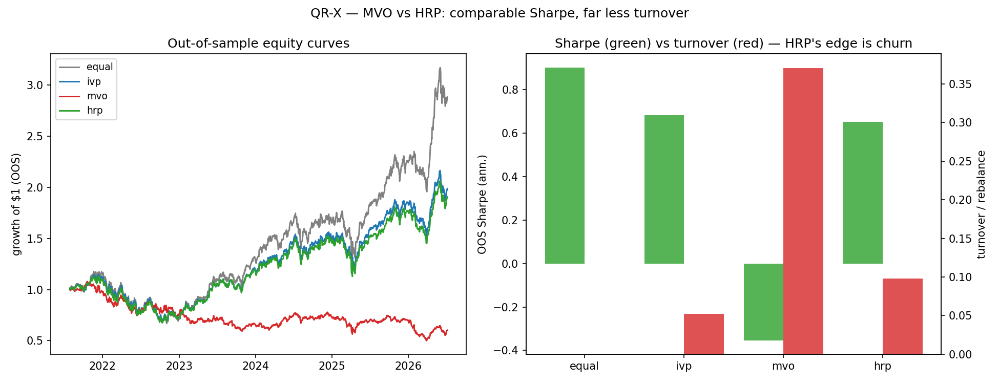

# Portfolio Construction (QR-X) — MVO vs HRP

The optional Track-QR extension: a clean, self-contained allocation question in
the same spirit as A5's mean-variance PortfolioBuilder, judged by the same
guardrails as everything else. Hierarchical clustering is the only ML here — and
it forecasts nothing.

## QR-X — Hierarchical Risk Parity vs mean-variance ✅

[`scripts/research/portfolio/allocators.py`](../../../scripts/research/portfolio/allocators.py)
(the allocators) and
[`compare_allocators.py`](../../../scripts/research/portfolio/compare_allocators.py)
(the walk-forward comparison), verified by `tests/python/test_allocators.py`
(11 cases). Full result:
[`hrp_vs_mvo_summary.md`](hrp_vs_mvo_summary.md).



Four allocators on the 15-name QR4 universe, each turning a trailing covariance
into weights that sum to 1:

- **MVO** (minimum-variance) — `w ∝ Σ⁻¹·1`, the textbook optimum that **inverts**
  the covariance. Optimal in sample; unstable out of sample.
- **HRP** (López de Prado, AFML ch. 16) — cluster the correlation matrix into a
  tree, quasi-diagonalize Σ, then split capital by recursive bisection. **Never
  inverts Σ.**
- **IVP** (inverse-variance) and **equal-weight** (1/N) — naive baselines.

Walk-forward: 252-day trailing covariance, rebalanced every 21 days, weights held
over the next 21 days (59 rebalances, no lookahead), one OOS daily return series
per allocator. Temporal robustness is read the QR2 way — each series sliced into
CPCV blocks, per-block Sharpe spread reported.

### The honest three-part result

| Allocator | OOS Sharpe | Turnover/rebal |
|---|---|---|
| equal | **0.90** | 0.000 |
| ivp | 0.68 | 0.052 |
| mvo | **−0.35** | 0.370 |
| hrp | **0.65** | 0.098 |

1. **MVO collapses out-of-sample** — Sharpe **−0.35**. On 15 co-moving,
   near-all-appreciating tech names Σ is near-singular, so the inversion is wild
   enough to short legs and *lose money*, churning **3.8× more** than HRP. The
   textbook failure of matrix inversion, live on real data.
2. **HRP repairs it** — Sharpe **0.65** at **3.8× less** turnover. Never
   inverting Σ, it stays long-only, sane, and stable. The López de Prado result,
   confirmed.
3. **But 1/N still wins** — equal-weight **0.90** at zero turnover beats every
   covariance-based allocator. On a small, highly-correlated, trending universe
   the assumption-free portfolio is the bar (DeMiguel–Garlappi–Uppal).

**Takeaway.** HRP's value here is **risk control, not alpha**: hierarchical
clustering makes a covariance-based book *usable* where the textbook optimizer is
*unusable* — but naive diversification is still the bar none of them clears on
this universe. The ML-adjacent win requires predicting nothing, and the negative
(HRP < 1/N) is stated plainly because CPCV lets us trust it.

### Reproduce

```bash
venv/bin/python scripts/research/portfolio/compare_allocators.py
venv/bin/python -m pytest tests/python/test_allocators.py -q
```
