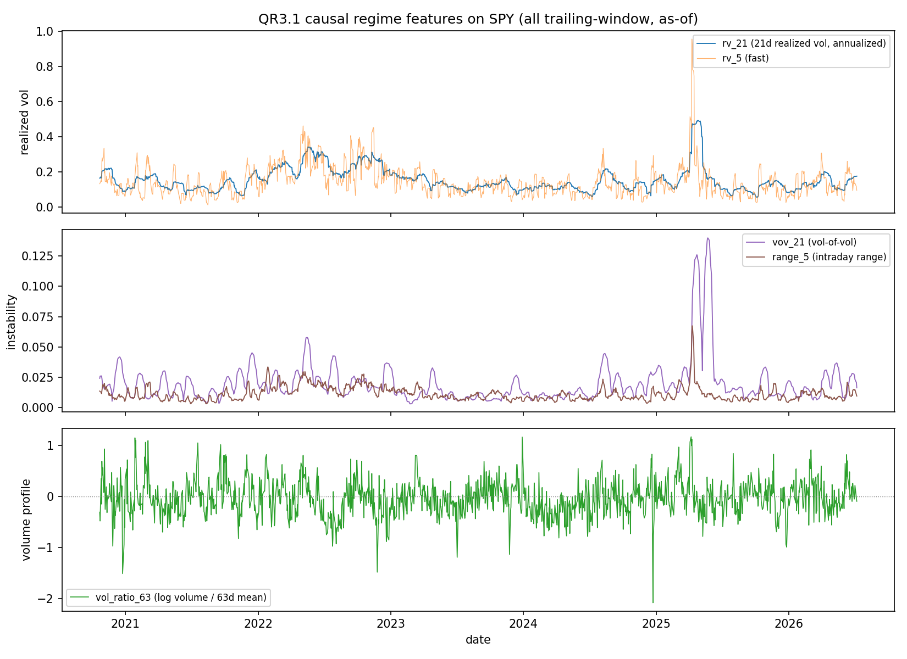
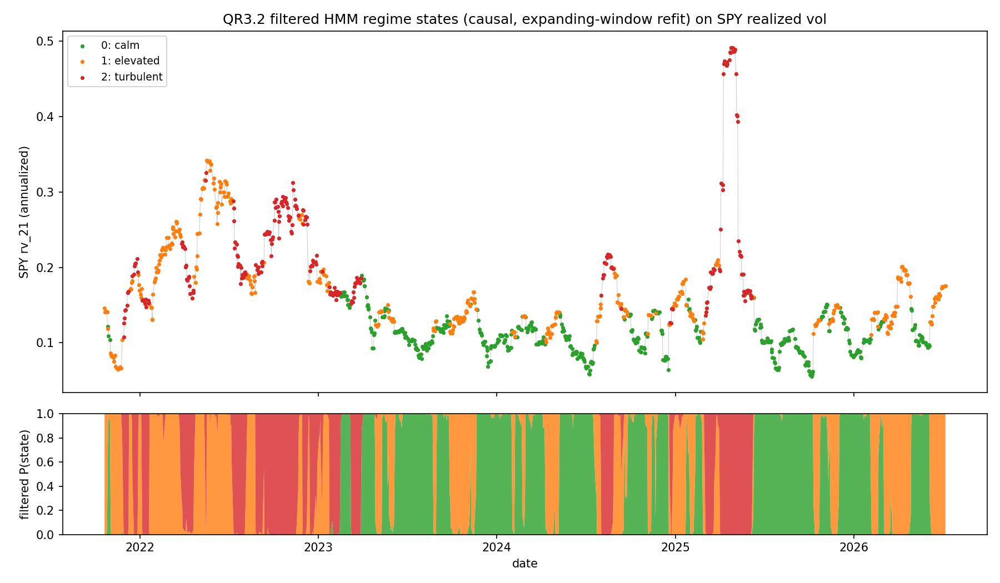

# Risk Architecture (QR-P3) — HMM regime overlay

Regime models detect the regime *after* it is underway and overfit easily, so
the honest expectation is **not** added return — it is **cut drawdown**: flip
the A5 risk-aversion λ toward minimum-variance / lower gross when the market
turns, which lifts Sharpe by shrinking the denominator. This track builds that
overlay while avoiding the look-ahead trap that silently inflates most published
regime backtests.

Build order: QR3.1 causal features → QR3.2 Gaussian HMM (filtered) → QR3.3
anti-whipsaw → QR3.4 integrate with the A5 λ.

## QR3.1 — Regime features ✅

[`scripts/research/regime/regime_features.py`](../../../scripts/research/regime/regime_features.py)
(verified by `tests/python/test_regime_features.py`, 7 cases). Causal
market-regime features on the SPY proxy, which the HMM will cluster into states
— it never sees returns directly. Every feature is a **trailing-window**
statistic, so the value at date t uses only data at dates ≤ t.

| Feature | Meaning |
|---|---|
| `rv_21` | 21-day annualized realized volatility — the primary regime axis |
| `rv_5` | 5-day annualized realized vol — fast moves that lead `rv_21` |
| `vov_21` | 21-day std of `rv_21` — vol-of-vol (how unstable vol itself is) |
| `range_5` | 5-day mean of (high−low)/close — intraday-range / spread-expansion proxy |
| `vol_ratio_63` | log(volume / 63-day mean volume) — volume profile |



**Data.** SPY daily bars fetched through the same Alpaca IEX path as the QR4
universe, so the features span **2020-10-22 → 2026-07-07** and align almost
exactly with the stat-arb signal dates (the overlay can map regime → λ
day-by-day). Computed on *unadjusted* SPY — dividends (~0.3–0.5%/quarter) are
negligible for volatility/range features, and the volume *ratio* is robust to
the IEX-partial feed (numerator and denominator scale together). The window
begins mid-2020, so it captures the 2022 bear (rv_21 ≈ 0.24) and the April 2025
selloff (peak rv_21 ≈ 0.49) but **not** the March 2020 COVID crash — a stated
coverage limitation.

**As-of contract (the no-look-ahead guarantee QR3.2 rests on):** row t is a
trailing-window statistic of rows ≤ t; warm-up rows are dropped (the frame
begins after the 63-day volume window fills). The HMM must consume the
*filtered* feature at t and act no earlier than t+1.

**Verified (the done-when):** a clean 1,431 × 5 feature frame with zero NaNs;
the features separate a synthetic calm→turbulent regime shift (rv_21 more than
doubles); and **strict causality** — appending or perturbing any future data
leaves every already-emitted row bit-identical, and `rv_21` at t matches the
std of exactly the trailing 21 returns ending at t.

### Reproduce

```bash
# refetch SPY (needs APCA_* env) or use the committed data/regime/SPY.csv
venv/bin/python scripts/research/regime/regime_features.py
venv/bin/python -m pytest tests/python/test_regime_features.py -q
```

Outputs: `data/regime/regime_features.parquet`, `data/regime/regime_manifest.json`,
and the committed plot above.

## QR3.2 — Gaussian HMM, fit causally ✅

[`scripts/research/regime/regime_hmm.py`](../../../scripts/research/regime/regime_hmm.py)
(verified by `tests/python/test_regime_hmm.py`, 8 cases). A diagonal-covariance
Gaussian HMM clusters the QR3.1 features into K states, **discovered** by EM then
**labelled by vol** (sorted by the rv_21 emission mean → 0 calm … K−1
turbulent). Implemented in pure numpy — no hmmlearn/sklearn — specifically so
the filtered-vs-smoothed distinction is explicit, not hidden behind a library
call.

**The sophistication point — two look-ahead traps, both avoided:**

1. **Smoothed vs filtered inference.** `hmmlearn`'s `predict` / `predict_proba`
   return the Viterbi path / smoothed posterior `P(sₜ | y₁..y_T)`, which use the
   *whole* series — a look-ahead bug. The live quantity is the **filtered**
   posterior `P(sₜ | y₁..yₜ)` from the forward pass alone. We compute it
   ourselves (`forward_filter`).
2. **The model parameters themselves.** Fitting one HMM over all history and
   then filtering *still* leaks — the means/covariances/transitions saw the
   future. So the state series is produced on an **expanding window**: refit
   only on data ≤ t (periodically, for cost), standardization frozen at each
   refit, filtered state at t from observations ≤ t.

The done-when is the operational test of both: **the live state at t is
unchanged when future data is appended** — a prefix run and a full run agree
bit-for-bit on their overlap.

### Result on SPY (3 states, 1,180 days from 2021-10)



Three states emerge, cleanly vol-ordered — **calm (mean rv 10.9%, 43% of days) /
elevated (17.2%, 35%) / turbulent (22.8%, 22%)**. Honest reporting per the
brief: a *distinct* "crash" state did **not** separate out (state 2 is
"turbulent" at 23%, not a 40%+ crash cluster) — the data over this window
supports calm/elevated/turbulent, not calm/high/crash. The classification tracks
the tape: the April 2025 selloff (rv 0.49) is 21/21 days turbulent; the 2023–24
grind is mostly calm. The states also **flip-flop between adjacent regimes** —
which is exactly the turnover problem QR3.3's anti-whipsaw dwell time addresses.

**Verified (the done-when):** 8 pytest cases — the future-append invariance
(states + filtered probs bit-identical on the overlap), the forward filter
ignoring t+1, filtered genuinely differing from a smoothed pass on overlapping
regimes, recovery of a calm→turbulent→calm world (checked only where the model
has seen both regimes — causal detection *lags* onset, honestly), vol-ordered
labels, normalized probabilities, and seed determinism.

### Reproduce

```bash
venv/bin/python scripts/research/regime/regime_hmm.py   # reads regime_features.parquet (~9s)
venv/bin/python -m pytest tests/python/test_regime_hmm.py -q
```

Outputs: `data/regime/regime_states.parquet` (date, state, p_state_0..K-1),
`data/regime/regime_hmm_manifest.json`, and the committed plot above.

## QR3.3 — Anti-whipsaw — *next*

## QR3.4 — Integrate with the A5 λ — *pending*
