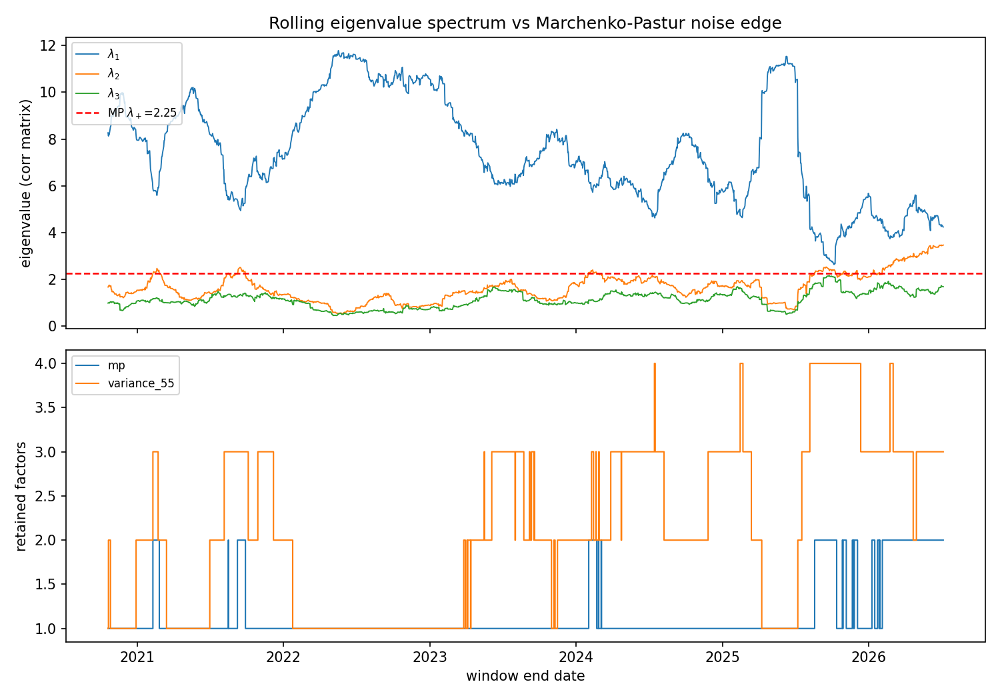

# Eigenportfolio stat arb (QR-P1) — research artifacts

Working notes and committed artifacts for the QR4 pipeline, chunk by chunk.

## QR4.1 — Universe & standardized-returns matrix

Input layer for the eigenportfolio stat-arb pipeline (QR-P1): a T×N daily
returns matrix `R` and its rolling-standardized counterpart `Y` over a
15-name large-cap US technology universe. Built by
[`scripts/research/statarb/build_universe.py`](../../../scripts/research/statarb/build_universe.py);
verified by `tests/python/test_build_universe.py` (13 cases).

### Universe

AAPL MSFT GOOG AMZN META NVDA AVGO AMD INTC QCOM TXN MU ADBE CRM ORCL

One correlated sector on purpose — PCA needs common factor structure to
find (measured mean pairwise return correlation on the built matrix: 0.44).
All names trade $1B+/day, so QR4.7's Engine B order-size sweeps are
meaningful. 15 names per the roadmap's "prove it on 10–15 before scaling
to 100."

### Provenance & pipeline

- **Source:** Alpaca daily bars, `adjustment=raw`, IEX feed (SIP is
  forbidden on the free data plan; the script tries SIP and falls back).
  Raw per-symbol CSVs are committed under `data/universe/` so the build is
  reproducible offline; Parquet outputs are regenerated, not committed
  (`*.parquet` is gitignored).
- **History:** IEX daily history begins 2020-07-27, so the panel runs
  2020-07-27 → present (~1,490 trading days), not the 2018 start the
  script requests by default. The window still spans the 2021 melt-up, the
  2022 bear, and the 2023–25 rally.
- **Adjustment is ours, not the vendor's:** bars are fetched unadjusted and
  back-adjusted through the audited B2 handler
  (`scripts/data/corporate_actions.py`) from
  `config/corporate_actions.csv`. Six splits apply in-window (AAPL 4:1,
  GOOG 20:1, AMZN 20:1, NVDA 4:1 + 10:1, AVGO 10:1 — the AVGO row was
  added for this universe). On the built matrix the AAPL 2020-08-31 split
  day shows +3.4%, not the −75% the raw series contains.
- **Cleaning is B1-style — repaired and counted, never silent:** closes are
  assembled on the union trading-day grid; interior gaps are
  forward-filled and reported per symbol (current build: CRM 3, ORCL 3);
  rows before every name has printed are dropped. Any single-day |return|
  > 45% is flagged loudly as a suspected missing corporate action (current
  build: none flagged).
- **Returns:** simple daily `R_t = P_t / P_{t−1} − 1`.
- Every repair, adjustment, and flag lands in
  `data/universe/universe_manifest.json` alongside the outputs.

### As-of alignment (the no-look-ahead contract)

Row `t` of the standardized matrix is
`Y_t = (R_t − mean_w(t)) / std_w(t)` where the mean/std come from the
**trailing** window `r_{t−w+1} … r_t` inclusive (default w = 60, ddof = 1)
— every input is observable at the close of day `t`. Rows before the
window is full are **dropped**, never standardized against short samples.
Consequences, both enforced by tests:

1. **Causality:** appending future data never changes an already-emitted
   row (`test_rolling_standardize_is_causal` asserts bit-identical
   prefixes).
2. **Execution lag:** a consumer of row `t` knows it only at the close of
   `t` and must not execute before session `t+1`. Downstream QR4 stages
   inherit this contract from the manifest's `as_of_alignment` field.

### Known limitations (stated, not hidden)

- **Survivorship/selection bias:** the universe is today's large-cap tech
  names applied retroactively. Fine for the thesis question (execution
  realism + deflated Sharpe on a given strategy), not for claiming the
  signal generalizes to a point-in-time universe.
- **Dividends:** only events listed in the actions file are adjusted, so
  ex-dividend days carry a small artificial negative return (~0.2–0.7%
  quarterly for the payers here) — second-order against ~2% daily vol at
  daily rebalance frequency.
- **IEX-only feed:** IEX prints ~2–3% of consolidated volume; daily closes
  track the consolidated tape closely but are not identical to it.

### Reproduce

```bash
set -a; source .env; set +a   # APCA_API_KEY_ID / APCA_API_SECRET_KEY
venv/bin/python scripts/research/statarb/build_universe.py --fetch   # refetch + build
venv/bin/python scripts/research/statarb/build_universe.py           # rebuild from committed CSVs
venv/bin/python -m pytest tests/python/test_build_universe.py -q
```

Outputs: `data/universe/universe_returns.parquet`,
`data/universe/universe_standardized.parquet`,
`data/universe/universe_manifest.json`. Current build: 1,432 standardized
rows × 15 names (2020-10-20 → 2026-07-06), zero NaNs in both matrices.

## QR4.2 — Rolling PCA + Marchenko-Pastur factor count

On each trailing 60-day window,
[`scripts/research/statarb/rolling_pca.py`](../../../scripts/research/statarb/rolling_pca.py)
eigendecomposes the correlation matrix of the window's returns (the
correlation matrix of raw returns over a window *is* the covariance of
within-window standardized returns, so the Avellaneda-Lee standardization
is implicit) and retains factors by the **Marchenko-Pastur cutoff**: for
aspect ratio `q = N/T = 15/60`, pure-noise eigenvalues fall below
`λ+ = (1 + √q)² = 2.25`; whatever clears the edge carries structure.
Fixed-count and explain-X%-variance modes are supported for comparison.
Eigenportfolio weights are `Q_i^(j) = v_i^(j)/σ_i` (inverse-vol, per
window) with a deterministic eigenvector sign convention; factor returns
`F_j = Σ_i Q_i^(j) R_i` are emitted long-format (date, factor, ret — no
NaN padding).

### Results on the current build (1,432 windows, 2020-10-20 → 2026-07-06)



- **The market mode is unambiguous:** λ₁ median **7.11** — a median
  **47.4%** of total variance — range 2.64–11.78, above the λ+ = 2.25
  noise edge in **every** window.
- **MP retains 1 factor in 86% of windows, 2 in 14%:** λ₂ crosses the
  edge only episodically (early 2021, stretches of 2024, and sustainedly
  from late 2025 onward) — the second factor is real sometimes, noise
  most of the time, and the cutoff tracks that honestly.
- **The comparison mode shows why "principled, not arbitrary" matters:**
  the explain-55%-variance rule wobbles between 1 and 4 factors over the
  same sample, retaining eigenvalues far below the noise edge whenever
  the market mode weakens — exactly the arbitrariness MP removes.

### Verification (`tests/python/test_rolling_pca.py`, 11 cases)

The two done-when tests: the top eigenvector of a synthetic
block-correlated matrix is recovered — analytically (equicorrelated block
⇒ uniform eigenvector, λ₁ = 1 + (N−1)ρ, both matched to tolerance) and
structurally (loads near-uniformly on the correlated block, ~0 on the
noise block) — and the MP cutoff retains **0** factors on a pure-noise
matrix while keeping exactly the planted factor when one exists. Plus:
inverse-vol weight ratios and factor returns verified in closed form on a
perfectly-correlated pair, mode selection on a hand-built spectrum,
degenerate-column rejection, and the same causality test as QR4.1
(appending future data leaves every emitted window bit-identical).

### Reproduce

```bash
venv/bin/python scripts/research/statarb/rolling_pca.py   # reads universe_returns.parquet
venv/bin/python -m pytest tests/python/test_rolling_pca.py -q
```

Outputs: `data/universe/eigen_spectrum.parquet`,
`data/universe/factor_counts.parquet`, `data/universe/factor_returns.parquet`,
`data/universe/rolling_pca_manifest.json`, and the committed plot above.
