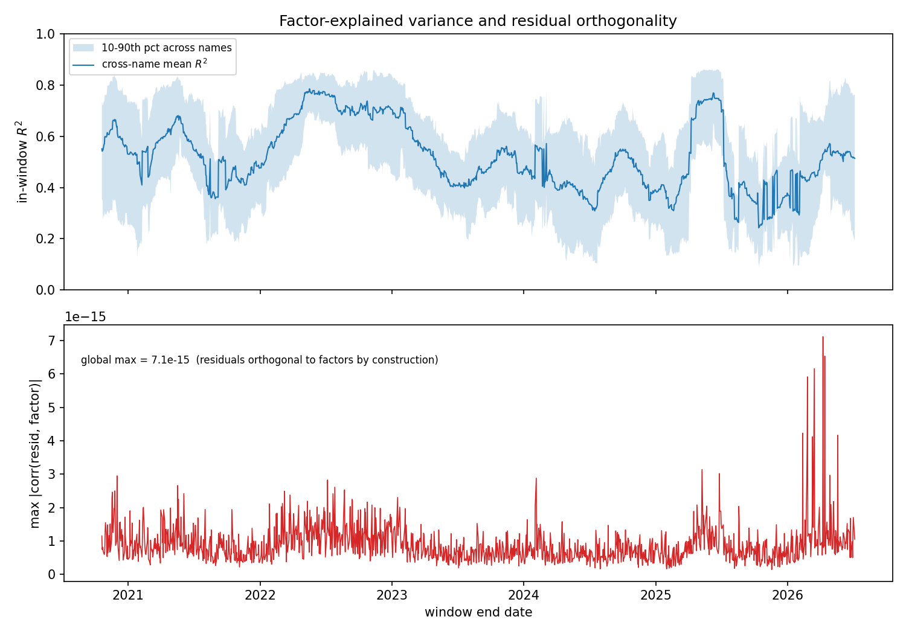
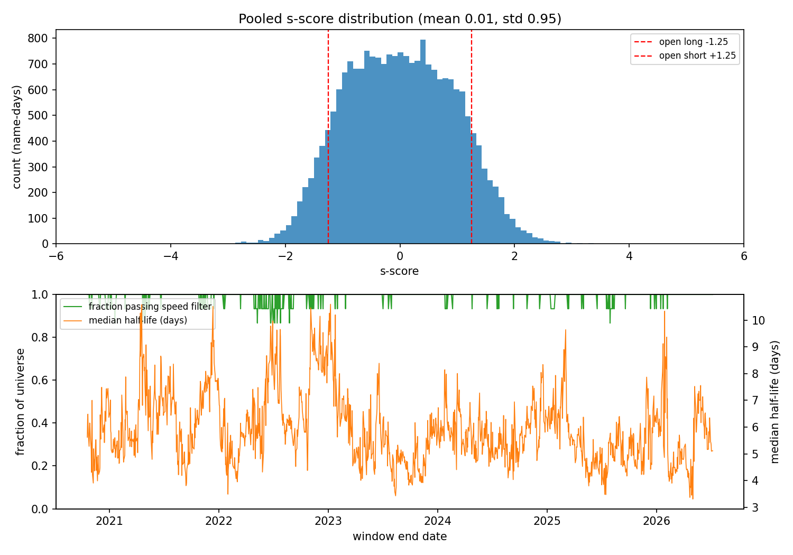
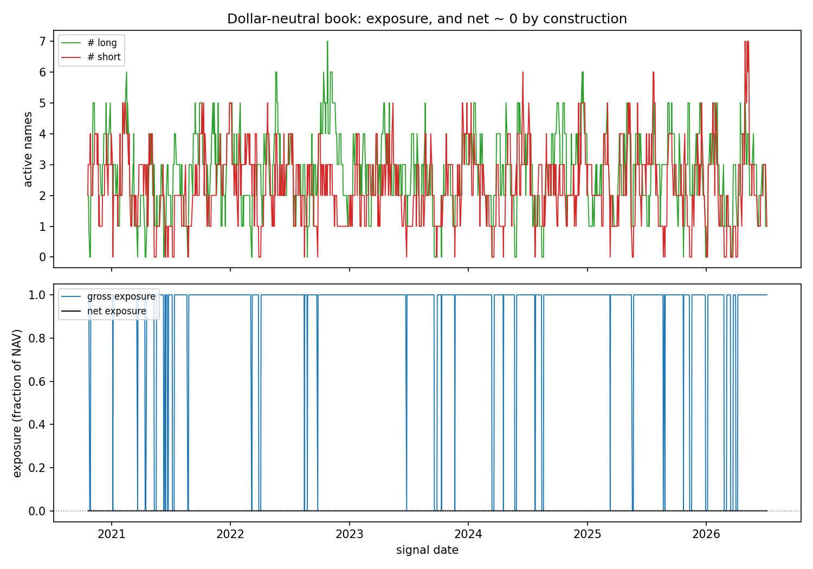
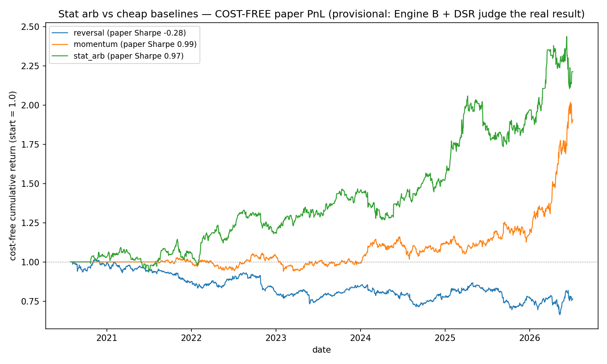

# Eigenportfolio stat arb (QR-P1) — research artifacts

Working notes and committed artifacts for the QR4 pipeline, chunk by chunk.

## QR4.1 — Universe & standardized-returns matrix

Input layer for the eigenportfolio stat-arb pipeline (QR-P1): a T×N daily
returns matrix `R` and its rolling-standardized counterpart `Y` over a
15-name large-cap US technology universe. Built by
[`scripts/research/statarb/build_universe.py`](../../../scripts/research/statarb/build_universe.py);
verified by `tests/python/test_build_universe.py` (13 cases).

### Universe

AAPL MSFT GOOG AMZN META NVDA AVGO AMD INTC QCOM TXN MU ADBE CRM ORCL

One correlated sector on purpose — PCA needs common factor structure to
find (measured mean pairwise return correlation on the built matrix: 0.44).
All names trade $1B+/day, so QR4.7's Engine B order-size sweeps are
meaningful. 15 names per the roadmap's "prove it on 10–15 before scaling
to 100."

### Provenance & pipeline

- **Source:** Alpaca daily bars, `adjustment=raw`, IEX feed (SIP is
  forbidden on the free data plan; the script tries SIP and falls back).
  Raw per-symbol CSVs are committed under `data/universe/` so the build is
  reproducible offline; Parquet outputs are regenerated, not committed
  (`*.parquet` is gitignored).
- **History:** IEX daily history begins 2020-07-27, so the panel runs
  2020-07-27 → present (~1,490 trading days), not the 2018 start the
  script requests by default. The window still spans the 2021 melt-up, the
  2022 bear, and the 2023–25 rally.
- **Adjustment is ours, not the vendor's:** bars are fetched unadjusted and
  back-adjusted through the audited B2 handler
  (`scripts/data/corporate_actions.py`) from
  `config/corporate_actions.csv`. Six splits apply in-window (AAPL 4:1,
  GOOG 20:1, AMZN 20:1, NVDA 4:1 + 10:1, AVGO 10:1 — the AVGO row was
  added for this universe). On the built matrix the AAPL 2020-08-31 split
  day shows +3.4%, not the −75% the raw series contains.
- **Cleaning is B1-style — repaired and counted, never silent:** closes are
  assembled on the union trading-day grid; interior gaps are
  forward-filled and reported per symbol (current build: CRM 3, ORCL 3);
  rows before every name has printed are dropped. Any single-day |return|
  > 45% is flagged loudly as a suspected missing corporate action (current
  build: none flagged).
- **Returns:** simple daily `R_t = P_t / P_{t−1} − 1`.
- Every repair, adjustment, and flag lands in
  `data/universe/universe_manifest.json` alongside the outputs.

### As-of alignment (the no-look-ahead contract)

Row `t` of the standardized matrix is
`Y_t = (R_t − mean_w(t)) / std_w(t)` where the mean/std come from the
**trailing** window `r_{t−w+1} … r_t` inclusive (default w = 60, ddof = 1)
— every input is observable at the close of day `t`. Rows before the
window is full are **dropped**, never standardized against short samples.
Consequences, both enforced by tests:

1. **Causality:** appending future data never changes an already-emitted
   row (`test_rolling_standardize_is_causal` asserts bit-identical
   prefixes).
2. **Execution lag:** a consumer of row `t` knows it only at the close of
   `t` and must not execute before session `t+1`. Downstream QR4 stages
   inherit this contract from the manifest's `as_of_alignment` field.

### Known limitations (stated, not hidden)

- **Survivorship/selection bias:** the universe is today's large-cap tech
  names applied retroactively. Fine for the thesis question (execution
  realism + deflated Sharpe on a given strategy), not for claiming the
  signal generalizes to a point-in-time universe.
- **Dividends:** only events listed in the actions file are adjusted, so
  ex-dividend days carry a small artificial negative return (~0.2–0.7%
  quarterly for the payers here) — second-order against ~2% daily vol at
  daily rebalance frequency.
- **IEX-only feed:** IEX prints ~2–3% of consolidated volume; daily closes
  track the consolidated tape closely but are not identical to it.

### Reproduce

```bash
set -a; source .env; set +a   # APCA_API_KEY_ID / APCA_API_SECRET_KEY
venv/bin/python scripts/research/statarb/build_universe.py --fetch   # refetch + build
venv/bin/python scripts/research/statarb/build_universe.py           # rebuild from committed CSVs
venv/bin/python -m pytest tests/python/test_build_universe.py -q
```

Outputs: `data/universe/universe_returns.parquet`,
`data/universe/universe_standardized.parquet`,
`data/universe/universe_manifest.json`. Current build: 1,432 standardized
rows × 15 names (2020-10-20 → 2026-07-06), zero NaNs in both matrices.

## QR4.2 — Rolling PCA + Marchenko-Pastur factor count

On each trailing 60-day window,
[`scripts/research/statarb/rolling_pca.py`](../../../scripts/research/statarb/rolling_pca.py)
eigendecomposes the correlation matrix of the window's returns (the
correlation matrix of raw returns over a window *is* the covariance of
within-window standardized returns, so the Avellaneda-Lee standardization
is implicit) and retains factors by the **Marchenko-Pastur cutoff**: for
aspect ratio `q = N/T = 15/60`, pure-noise eigenvalues fall below
`λ+ = (1 + √q)² = 2.25`; whatever clears the edge carries structure.
Fixed-count and explain-X%-variance modes are supported for comparison.
Eigenportfolio weights are `Q_i^(j) = v_i^(j)/σ_i` (inverse-vol, per
window) with a deterministic eigenvector sign convention; factor returns
`F_j = Σ_i Q_i^(j) R_i` are emitted long-format (date, factor, ret — no
NaN padding).

### Results on the current build (1,432 windows, 2020-10-20 → 2026-07-06)


- **The market mode is unambiguous:** λ₁ median **7.11** — a median
  **47.4%** of total variance — range 2.64–11.78, above the λ+ = 2.25
  noise edge in **every** window.
- **MP retains 1 factor in 86% of windows, 2 in 14%:** λ₂ crosses the
  edge only episodically (early 2021, stretches of 2024, and sustainedly
  from late 2025 onward) — the second factor is real sometimes, noise
  most of the time, and the cutoff tracks that honestly.
- **The comparison mode shows why "principled, not arbitrary" matters:**
  the explain-55%-variance rule wobbles between 1 and 4 factors over the
  same sample, retaining eigenvalues far below the noise edge whenever
  the market mode weakens — exactly the arbitrariness MP removes.

### Verification (`tests/python/test_rolling_pca.py`, 11 cases)

The two done-when tests: the top eigenvector of a synthetic
block-correlated matrix is recovered — analytically (equicorrelated block
⇒ uniform eigenvector, λ₁ = 1 + (N−1)ρ, both matched to tolerance) and
structurally (loads near-uniformly on the correlated block, ~0 on the
noise block) — and the MP cutoff retains **0** factors on a pure-noise
matrix while keeping exactly the planted factor when one exists. Plus:
inverse-vol weight ratios and factor returns verified in closed form on a
perfectly-correlated pair, mode selection on a hand-built spectrum,
degenerate-column rejection, and the same causality test as QR4.1
(appending future data leaves every emitted window bit-identical).

### Reproduce

```bash
venv/bin/python scripts/research/statarb/rolling_pca.py   # reads universe_returns.parquet
venv/bin/python -m pytest tests/python/test_rolling_pca.py -q
```

Outputs: `data/universe/eigen_spectrum.parquet`,
`data/universe/factor_counts.parquet`, `data/universe/factor_returns.parquet`,
`data/universe/rolling_pca_manifest.json`, and the committed plot above.

## QR4.3 — Idiosyncratic residuals

[`scripts/research/statarb/residuals.py`](../../../scripts/research/statarb/residuals.py)
decomposes each name's return into its exposure to the retained
eigenportfolio factors and an idiosyncratic residual. Per trailing window
ending at date t, using the same-window factor returns from QR4.2:

```
R_i = α_i + Σ_j β_ij F_j + ε_i      (OLS — one design [1 | F] for all names)
X_i = cumsum(ε_i)                    (the mean-reverting process QR4.4 trades)
```

`ε_i` is the idiosyncratic return; the cumulative residual `X_i` is the
auxiliary process the OU/AR(1) fit in QR4.4 consumes. A single least-squares
solve of the shared design handles the whole cross-section per window.

### Results on the current build (1,432 windows, 2020-10-20 → 2026-07-06)



- **Half of each name's daily variance is idiosyncratic:** the cross-name
  mean in-window R² has median **50.9%** (range 24–79%), tracking the
  market regime — factor-explained variance peaks in the 2022 stress and
  recedes in calm stretches. The complement is the tradeable residual, so
  the strategy has real signal to work with.
- **Per-name idiosyncratic share ranges widely:** ORCL (median R² 0.35) and
  INTC (0.39) are the most idiosyncratic; MSFT and AVGO (both 0.65) the most
  market-driven — a sensible cross-section for a sector portfolio.
- **Residuals are orthogonal to the factors to machine precision:** the
  worst residual-factor \|corr\| across all 1,432 windows is **7.1×10⁻¹⁵**
  (bottom panel) — the QR4.3 done-when, confirmed on real data.

### Two structural facts QR4.4 depends on

1. **Orthogonality (the done-when).** OLS residuals with an intercept are
   orthogonal to every regressor by construction, so `corr(ε_i, F_j) ≈ 0` to
   numerical precision. This is the correctness test — drop the intercept and
   it breaks.
2. **Sum-to-zero.** That same intercept forces `Σ_n ε_i(n) = 0` over the fit
   window, so the cumulative residual returns to ~0 at the window's right
   edge: `X_i(t) ≈ 0`. The tradeable information is the *path* of `X` across
   the window — its excursions and mean-reversion speed — which QR4.4's OU
   fit captures through the estimated equilibrium `m` and speed `κ`, **not**
   the endpoint level. Flagged here (and enforced by a test) so QR4.4 builds
   the s-score from the OU parameters rather than a naive "current X".

### Verification (`tests/python/test_residuals.py`, 10 cases)

The done-when — residuals orthogonal to the retained factors, both when the
factors are handed in and through the real window-PCA path (max \|corr\|
below 1e-9). Plus: known-beta recovery on a low-noise factor model, the
cumulative-residual identity and its sum-to-zero property, R² high for
factor-driven returns and ~0 for noise-vs-unrelated-factor, the intercept-only
(m=0) edge case, and the same causality guarantee as QR4.1/QR4.2.

### Reproduce

```bash
venv/bin/python scripts/research/statarb/residuals.py   # reads universe_returns.parquet
venv/bin/python -m pytest tests/python/test_residuals.py -q
```

Outputs: `data/universe/residual_r2.parquet`,
`data/universe/residual_market_beta.parquet`,
`data/universe/residual_diagnostics.parquet`,
`data/universe/residual_manifest.json`, and the committed plot above.

## QR4.4 — OU fit + s-score

[`scripts/research/statarb/ou_sscore.py`](../../../scripts/research/statarb/ou_sscore.py)
models each name's cumulative residual `X_i` as a mean-reverting
Ornstein-Uhlenbeck process, fit per window as its AR(1) discretization
`X_{n+1} = a + b·X_n + ζ` (OLS on the lagged series). With step `Δt = 1/252`:

```
κ        = −ln(b)/Δt                 mean-reversion speed
m        = a/(1 − b)                 equilibrium level
σ_eq     = √( Var(ζ)/(1 − b²) )      equilibrium std
s        = (X_last − m)/σ_eq         the s-score
```

**Speed filter (critical).** A slow-reverting fit is a spurious signal — over
a short window a near-random-walk (`b → 1`) produces a huge, meaningless
s-score. A name is kept only if its mean-reversion time `τ = 1/κ` is short
relative to the window: `τ < ½·window`. In step units `τ = −1/ln(b)`, so the
filter is `Δt`-independent — keep `b < e^{−2/window} ≈ 0.967` at window 60.
`b` outside `(0, 1)` is not mean-reverting at all and is rejected outright.

**The sum-to-zero handoff, resolved.** QR4.3's residuals sum to zero
in-window, so `X_last ≈ 0` and the s-score reduces to `s ≈ −m/σ_eq`: the
signal is carried by where the OU equilibrium sits relative to the pinned
endpoint. A large positive `m` (equilibrium above the current 0) means the
residual is expected to revert *up* → the name is cheap → a *negative*
s-score → a buy under the Avellaneda-Lee bands (QR4.5). The estimators are
written for a general `X` (the unit tests recover `κ/m/σ_eq` from genuine OU
paths that do not end at zero); the pinned case is just where real data lands.

### Results on the current build (1,432 windows, 2020-10-20 → 2026-07-06)



- **The s-score is genuinely standardized:** pooled over 21,297 valid
  name-days it has **mean 0.01, std 0.95** — no directional bias and unit-ish
  scale, exactly what a correct OU/σ_eq normalization should produce (a strong
  end-to-end sanity check that the whole PCA → residual → OU chain is
  calibrated). Tails run to ±4.
- **Idiosyncratic residuals revert fast:** median half-life **5.8 days**, so
  **99.1%** of name-days clear the speed filter — the mean-reversion regime
  Avellaneda-Lee stat arb needs. Half-life oscillates 4–10 days with the
  market regime.
- **~19% of valid name-days sit beyond the ±1.25 open bands** — a plausible
  trade frequency before QR4.5 converts crossings into dollar-neutral
  positions.

### Verification (`tests/python/test_ou_sscore.py`, 13 cases)

The two done-when tests: on a simulated OU path with known `(κ, m, σ)` the
estimator recovers all three within tolerance (20k steps), and the speed
filter keeps fast reversion (`τ ≈ 10 < 30`) while rejecting slow (`τ ≈ 100`)
and near-random-walk (`b = 0.9995`) series — filtered names emit no s-score.
Plus: the threshold flips exactly at `½·window`, the s-score matches its
formula and its sign tracks `X_last − m`, the pinned-endpoint case gives
exactly `−m/σ_eq` (the QR4.3 handoff), constant-series rejection, and the
same causality guarantee as the rest of the pipeline.

### Reproduce

```bash
venv/bin/python scripts/research/statarb/ou_sscore.py   # reads universe_returns.parquet
venv/bin/python -m pytest tests/python/test_ou_sscore.py -q
```

Outputs: `data/universe/ou_sscore.parquet`, `data/universe/ou_kappa.parquet`,
`data/universe/ou_speed_ok.parquet`, `data/universe/ou_manifest.json`, and the
committed plot above.

## QR4.5 — Signals + dollar-neutral weights

[`scripts/research/statarb/signals.py`](../../../scripts/research/statarb/signals.py)
turns the QR4.4 s-scores into a dollar-neutral daily target book and writes it
in the exact `weights_YYYYMMDD.csv` / `symbol,weight` format the C++
`WeightsLoader` + `FactorStrategy` already consume — the handoff from the
Python research pipeline to the execution engine.

**Trading rules** (Avellaneda-Lee defaults — *starting points only*, the
overfitting-prone knobs QR-P2's deflated Sharpe must protect). A per-name state
machine with hysteresis:

```
flat  → long   if s < −1.25      (name cheap: residual reverts up)
flat  → short  if s > +1.25      (name rich)
long  → flat   if s > −0.50      (asymmetric close = drift-aware)
short → flat   if s < +0.75
any   → flat   if s is NaN       (speed filter rejected → stop trusting it)
```

**Dollar-neutral construction.** Active longs and shorts are each
equal-weighted so the sides cancel: each long `+gross/(2·n_long)`, each short
`−gross/(2·n_short)`. Net is then 0 regardless of how the counts split, and
gross exposure is `gross` (default 1.0 → 50% long / 50% short of NAV, since the
engine sizes `target_notional = weight · NAV`). A day with positions on only
one side cannot be neutralized, so the book goes flat. Every universe name is
written every day (inactive at 0.0) so the engine *closes* exited positions —
a name omitted from the file would keep its prior target.

**Execution lag (no look-ahead).** `FactorStrategy` loads `weights_<date>.csv`
at that date's close and rebalances then, so a signal from the window ending at
`t` (which uses the close of `t`) is written to `weights_<t+1>.csv` and executed
one trading day later. No order ever uses data beyond its own signal date.

### Results on the current build (1,432 signal dates, 2020-10-20 → 2026-07-06)



- **1,431 daily weight files**, dollar-neutral to machine precision:
  **max |net| = 1.4×10⁻¹⁶** across every day.
- **Gross is exactly the 1.0 cap on the 1,338 days a two-sided book exists**
  (94% of days); the other 6% have positions on only one side and correctly go
  flat.
- Average **2.7 long / 2.3 short** names, **16% mean daily turnover** — a
  plausible daily stat-arb book, not a hyperactive one.

### Verification (`tests/python/test_signals.py`, 15 cases + 1 C++ gtest)

The done-when — emitted files parse under the loader's exact rules (header,
finite doubles, `|w| ≤ 10`), are dated one day after the signal, and net to ~0
each day. Plus the hysteresis state machine (open/hold-through-dead-band/close,
NaN→flat, same-bar long↔short flip), the dollar-neutral algebra (net 0, gross
cap, one-sided→flat, gross scaling), diagnostics bounds, and causality. The
**C++ handoff is proven in C++**: `WeightsLoaderTest.LoadsDollarNeutralStatArbBook`
loads a book in this exact format through the real `WeightsLoader` and asserts
net ≈ 0, gross = 1, and that inactive names load as flat (0.0) targets.

### Reproduce

```bash
venv/bin/python scripts/research/statarb/signals.py   # reads universe_returns.parquet
venv/bin/python -m pytest tests/python/test_signals.py -q
./build/run_tests --gtest_filter='WeightsLoaderTest.LoadsDollarNeutralStatArbBook'
```

Outputs: `data/universe/weights/weights_YYYYMMDD.csv` (per execution date,
gitignored), `data/universe/signal_{weights,positions,diagnostics}.parquet`,
`data/universe/signal_manifest.json`, and the committed plot above.

## QR4.6 — Cheap baselines (the floor)

[`scripts/research/statarb/baselines.py`](../../../scripts/research/statarb/baselines.py)
builds the two dumb strategies the elaborate stat arb has to beat to justify
its complexity: **cross-sectional short-term reversal** (buy recent losers,
sell winners — reversal on *raw* returns, vs the stat arb's reversal on
*idiosyncratic residuals*) and **12-1 momentum** (buy 12-month winners skipping
the last month, the standard Jegadeesh-Titman construction). Each ranks the
universe daily, longs the top third / shorts the bottom third, and — reusing
QR4.5's `weights_from_positions` and `write_weight_files` *unchanged* — emits
the **identical** dollar-neutral `weights_YYYYMMDD.csv` format on the same
universe with the same execution lag. That shared path is what makes QR4.7's
Engine B comparison apples-to-apples.

> **Deviation from the proposal, on purpose.** The QR-track spec framed the
> baselines as additions to the C++ `MultiFactorCalculator`. They live in the
> Python harness instead so all three strategies share the stat-arb weight
> path rather than running through a separate one — the done-when's "same
> harness" requirement, satisfied by construction.

### Result — the cost-free floor (1,490 days, provisional)



| Strategy | Cost-free paper Sharpe | Mean daily turnover |
|---|---|---|
| eigen stat arb (QR4.5) | **0.97** | 0.16 |
| 12-1 momentum | **0.99** | **0.04** |
| short-term reversal | **−0.28** | 0.29 |

The honest read: **cost-free, the fancy stat arb only ties plain momentum and
both clear the reversal floor** (which loses money outright). This is exactly
why QR4.6 exists — and why the number is not the end of the story. The three
strategies have very different turnover (momentum 4%, stat arb 16%, reversal
29%), and Engine B charges for turnover. QR4.7 re-runs all three through the
full-depth book at 1×/10×/50× size, and QR-P2 deflates every Sharpe for the
configurations tried. **These paper Sharpes are candidates, not results.**

### Verification (`tests/python/test_baselines.py`, 13 cases)

Signal correctness (reversal longs the loser; momentum longs the 12-1 winner
*and skips the recent month*, verified by showing a name that trends up then
crashes is still a momentum winner while reversal ranks it oppositely);
cross-sectional selection (long top-k / short bottom-k, disjoint equal sets,
<2 valid → flat); the paper-PnL lag (signal at t earns the return at
t+lag+1, to the day); dollar-neutral weights and loader-compatible files
identical to QR4.5; momentum warm-up flat until the 252-day lookback fills;
and causality.

### Reproduce

```bash
venv/bin/python scripts/research/statarb/signals.py    # stat-arb weights first
venv/bin/python scripts/research/statarb/baselines.py  # baselines + 3-way compare
venv/bin/python -m pytest tests/python/test_baselines.py -q
```

Outputs: `data/universe/weights_{reversal,momentum}/weights_YYYYMMDD.csv`
(gitignored), `data/universe/baseline_{reversal,momentum}_{weights,positions}.parquet`,
`data/universe/baseline_manifest.json`, and the committed comparison plot.
